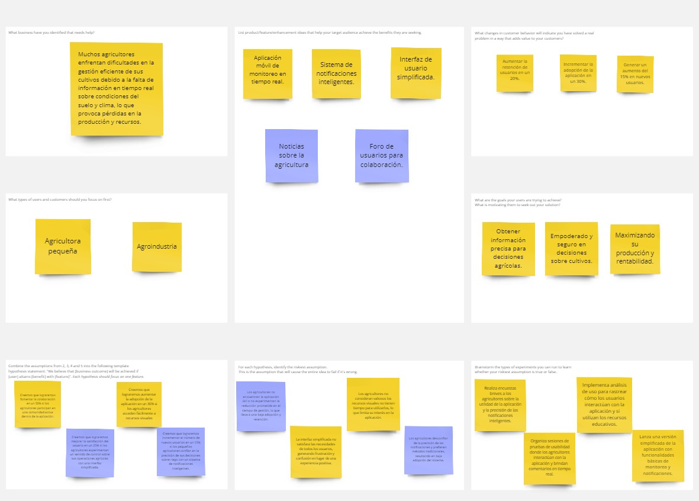

# Capítulo I: Introducción

## 1.1. Startup Profile

### 1.1.1. Descripción de la Startup

  

**IAgroT** surgió a partir de una necesidad identificada por un grupo de estudiantes de la Universidad Peruana de Ciencias Aplicadas, quienes se propusieron mejorar la eficiencia y sostenibilidad en la agricultura local. En su análisis, observaron que muchos agricultores carecían de acceso a tecnologías avanzadas que podrían optimizar la gestión de sus cultivos. Con este contexto en mente, se desarrolló una solución integral que combina dispositivos IoT con una aplicación móvil intuitiva, con el objetivo de transformar y modernizar la gestión agrícola.

- **Visión:** Ser líder en soluciones tecnológicas para la agricultura, empoderando a los agricultores con herramientas innovadoras que maximicen la productividad y promuevan prácticas sostenibles.

- **Misión:** Desarrollar y ofrecer dispositivos IoT accesibles y efectivos que permitan a los agricultores monitorear y optimizar el estado de sus cultivos en tiempo real, contribuyendo a una agricultura más eficiente y sostenible.

## 1.1.2. Perfiles de integrantes del equipo

<table>
  <tr>
    <td style="vertical-align: top; width: 40%;">
      Soy Lucas Benedetti Rivas, un joven de 24 años, estudiante del 8vo ciclo de la carrera de Ingeniería de Software en la Universidad Peruana de Ciencias Aplicadas. Además de mis estudios, me apasiona el desarrollo de aplicaciones web, utlizando Vue.js y Java con Springboot como herramientas principales, actividad a la que dedico gran parte de mi tiempo libre. Profesionalmente, me desempeño como practicante en una entidad financiera, donde he tenido la oportunidad de aplicar metodologías ágiles y participar en la mejora continua de procesos críticos.
    </td>
    <td style="vertical-align: top; width: 60%;">
      
    </td>
  </tr>

  <tr>
    <td style="vertical-align: top; width: 40%;">
      Soy Jonatan Curi Montero, me encuentro estudiando la carrera de Ingeniería de Software en la Universidad Peruana de Ciencias Aplicadas. Poseo conocimientos en los lenguajes TypeScript y Javascript. También, en frameworks como Angular, Vue y .Net. Tengo experiencia en el desarrollo de aplicaciones web, enfocandome principalmente en el Frontend. Considero que la comunicación es una característica fundamental en el equipo de trabajo. Profesionalmente, me encuentro haciendo practicas en una empresa que brinda servicios de contabilidad y facturación electronica en aplicacion web.
    </td>
    <td style="vertical-align: top; width: 60%;">
      
    </td>
  </tr>
  
  <tr>
    <td style="vertical-align: top; width: 40%;">
       Soy Clara Valverde Salazar, me encuentro estudiando la carrera de Ingeniería de Software en la Universidad Peruana de Ciencias Aplicadas. Poseo conocimientos en los lenguajes Javascript, Python y C#. También, en frameworks como Angular y .Net. Tengo experiencia en gestión de proyectos usando herramientas como Jira Software, Jira services Management, Confluence y Bigbucket. Profesionalmente, me encuentro haciendo practicas en una empresa desarrolladora de software que brinda servicios de soporte, consultoria y infraestructura en aplicacion web.
    </td>
    <td style="vertical-align: top; width: 60%;">
      
    </td>
  </tr>

  <tr>
    <td style="vertical-align: top; width: 40%;">
      Soy Willy David Valentin Ricaldi, estudio la carrera de Ingeniería de Software en la Universidad Peruana de Ciencias Aplicadas. Actualmente me encuentro trabajando en múltiples proyectos que involucran desarrollo, gestión y mantenemiento de Software para diversos sectores siguiendo y ejerciendo la filosofía DevSecOps. Tengo experiencia trabajando con tecnologías Frontend y Backend como Angular, React, Net, Spring Boot, Next y las diversas tecnologías que sostienen estos frameworks. Espero aportar mi conocimiento y experiencia al equipo para que esta idea salga a flote y pueda servir a las personas a transformarse digitalmente.
    </td>
    <td style="vertical-align: top; width: 60%;">
      
    </td>
  </tr>
  

</table>

## 1.2. Solution Profile

### 1.2.1. Antecedentes y problemática

La agricultura en el Perú ha sido durante siglos una de las actividades económicas más importantes, empleando a un gran porcentaje de la población. Según la Encuesta Nacional de Hogares realizada en el 2022, 4,380,066 peruanos reportaron que su actividad económica principal era la agricultura. Sin embargo, esta actividad económica solo contribuye al 5.2% del PBI debido a la baja productividad. De hecho, en comparación con el resto de actividades económicas, este sector es el que muestra la menor productividad, con 6,7 miles de soles por empleo.

Parte de la causa de esta baja productividad se atribuye al impacto del fenómeno de El Niño y La Niña, que provoca alteraciones climáticas severas, afectando los ciclos de cultivo y disminuyendo la capacidad productiva de las tierras agrícolas. El Centro Nacional de Estimación, Prevención y Reducción del Riesgo de Desastres (Cenapred) realizó un pronóstico de riesgo de déficit hídrico debido a la temporada de lluvias 2023-2024. El informe estima un total de 1.9 millones de hectáreas de superficie agrícola expuestas a riesgo elevado, de las cuales 1.3 millones corresponden a riesgo muy alto. El departamento más afectado sería Cusco, con 330,762 hectáreas en riesgo, lo cual representa el 100% de la superficie agrícola en este departamento.

Además, las sequías pueden afectar gravemente a los cultivos de varias maneras, incluyendo la reducción de la superficie cultivada, la pérdida de cosechas, la disminución del trabajo asalariado, deterioro en la calidad de los suelos y nutrientes, causando desertificación, erosión y salinización. De acuerdo con el Ministerio de Desarrollo Agrario y Riego (Midagri), los departamentos que reportan más de la mitad de la superficie agrícola expuesta a riesgo elevado de sequías generaron el 78.2% de las toneladas producidas de trigo en 2022.

Finalmente, se presenta el enfoque estructurado 5W2H:

| **Pregunta** | **Respuesta**                                                                                                         |
|--------------|-----------------------------------------------------------------------------------------------------------------------|
| **Who (Quién)**  | Agricultores (4,380,066 peruanos reportaron que su actividad económica principal era la agricultura).                |
| **What (Qué)**   | Baja productividad en la agricultura peruana, contribuyendo solo al 5.2% del PBI.                                     |
| **When (Cuándo)** | Períodos en los que se producen cambios climáticos o fenómenos, como la temporada de lluvias 2023-2024.               |
| **Where (Dónde)** | En el Perú, mayormente en la sierra por consecuencia del bioma.                                                         |
| **Why (Por qué)** | Fenómeno de El Niño y La Niña que provoca alteraciones climáticas severas y sequías, afectando la agricultura.        |
| **How (Cómo)**    | Las hectáreas de superficie agrícola están expuestas a riesgo elevado, perdiendo la cosecha.                            |
| **How many (Cuántos)** | 1.9 millones de hectáreas en riesgo elevado, con 1.3 millones en riesgo muy alto. Además, los departamentos que reportan más de la mitad de la superficie agrícola en riesgo elevado generaron el 78.2% de las toneladas de trigo producidas en 2022. |

## 1.2.2 Lean UX Process

### 1.2.2.1. Lean UX Problem Statements

El estado actual de la agricultura en el Perú se ha enfocado principalmente en pequeños y medianos agricultores que enfrentan desafíos significativos como la falta de acceso a información en tiempo real sobre el clima y las condiciones del suelo. Estos agricultores luchan con decisiones ineficientes y no pueden optimizar la producción debido a la falta de datos precisos.

Los Gaps identificado es que los productos y servicios existentes no abordan es la necesidad de una herramienta integral que combine tecnología IoT y analítica de datos para proporcionar información útil y en tiempo real a los agricultores, permitiéndoles adaptarse a las condiciones cambiantes.

Nuestro producto IAgroT abordará esta brecha al ofrecer un sistema de monitoreo IoT que recopile datos sobre humedad del suelo, condiciones climáticas y otros factores críticos que afectan la producción agrícola. A través de esta plataforma, los agricultores podrán tomar decisiones informadas que optimicen sus cultivos.

Nuestro enfoque inicial será en pequeños y medianos agricultores que buscan mejorar su productividad y sostenibilidad en un mercado competitivo.

Sabremos que hemos tenido éxito cuando obtengamos 200 usuarios activos y los ususarios reporten mejoras en eficiencia en sus cultivos en un tiempo de 6 meses desde el despliegue de la aplicacion.

### 1.2.2.2. Lean UX Assumptions
#### Business Outcomes

Utilizando el concepto de Pirate Metrics como marco para identificar los comportamientos clave que buscamos fomentar:

1. Adquisición (Acquisition)
Queremos que al menos el 60% de los pequeños y medianos agricultores en nuestra región conozcan y visiten nuestra plataforma IAgroT dentro de los primeros tres meses de lanzamiento.

2. Activación (Activation)
Buscamos que el 50% de los agricultores que visitan la plataforma creen una cuenta y configuren su perfil en los primeros días de uso.

3. Retención (Retention)
Deseamos que al menos el 40% de los usuarios activos utilicen regularmente la aplicación al menos una vez a la semana para monitorear sus cultivos y obtener recomendaciones, a partir del tercer mes.

4. Ingresos (Revenue)
Aspiramos a que el 20% de los usuarios que utilizan la plataforma opten por un plan de suscripción premium para acceder a funcionalidades avanzadas y soporte personalizado en los primeros seis meses.

5. Referidos (Referral)
Buscamos que al menos el 15% de nuestros usuarios actuales refieran a otros agricultores a nuestra plataforma a través de recomendaciones o programas de incentivos dentro del primer año.

#### Users Outcomes

Generamos un Prototype User

##### Descripción: 

Laura es una agricultora de 32 años que se dedica a cultivar hortalizas en una pequeña finca familiar. Tiene un nivel educativo medio y está abierta a usar nuevas tecnologías para optimizar su producción.

##### Objetivos:
Mejorar el rendimiento de sus cultivos.
Monitorear la salud del suelo y las condiciones climáticas.
Acceder a información relevante y actualizada sobre técnicas agrícolas.
##### Frustraciones:
Dificultades para acceder a información específica sobre su cultivo.
Falta de herramientas simples para el monitoreo de su finca.
Estrés por no saber si está tomando las decisiones correctas para su producción.
##### Comportamientos:
Usa su teléfono móvil para buscar información sobre agricultura.
Participa en grupos de Facebook sobre consejos agrícolas.
Consume contenido visual y tutoriales en Instagram sobre técnicas de cultivo.

#### Users Outcomes & Benefits

En grupo, discutimos sobre los beneficios que puede tener el usuario final hacia nuestro proyecto bajo nuestro Proto Usuario.

Quiere optimizar el riego de mis cultivos para mejorar su rendimiento y reducir el uso de agua.
Quiere sentirme segura de que estoy tomando decisiones informadas y responsables sobre mis cultivos, y orgullosa de ver mejoras en mi producción.
IAgroT me ayuda a monitorear las condiciones del suelo y el clima en tiempo real, lo que me permite hacer ajustes en el riego de manera efectiva.
Quiere acceder a información precisa y útil que me ayude a mejorar mi producción y a ser más eficiente en el uso de recursos.
Laura ajusta sus patrones de riego en función de los datos que recibe de IAgroT y reporta un aumento en la producción de sus cultivos.

#### Solution

##### Framing Question:
¿Qué soluciones podemos diseñar y construir que sirvan a nuestros usuarios y creen sus resultados deseados?

##### Ideas Generadas a Través de Affinity Mapping:
##### Aplicación Móvil de Monitoreo en Tiempo Real
###### Descripción: 
Desarrollar una aplicación móvil que permita a los agricultores monitorear las condiciones del suelo, la humedad y el clima en tiempo real.
###### Beneficio: 
Facilitar la toma de decisiones informadas sobre riego y cuidado de cultivos.

##### Sistema de Notificaciones Inteligentes
###### Descripción: 
Implementar un sistema de notificaciones que alerte a los usuarios sobre condiciones críticas, como sequías o excesos de agua, basado en datos de sensores.
###### Beneficio: 
Aumentar la proactividad del agricultor en la gestión de sus cultivos.

##### Interfaz de Usuario Simplificada

###### Descripción: 
Diseñar una interfaz fácil de usar para la aplicación, con gráficos claros y accesibles que presenten datos complejos de manera intuitiva.
###### Beneficio: 
Asegurar que incluso los agricultores con menos experiencia tecnológica puedan utilizar la aplicación efectivamente.

##### Funcionalidad de Recomendaciones Personalizadas

###### Descripción: 
Incluir un sistema de recomendaciones que sugiera prácticas de riego y fertilización basadas en el historial del usuario y condiciones actuales.
###### Beneficio: 
Ayudar a los agricultores a optimizar el uso de recursos y mejorar el rendimiento de los cultivos.

##### Integración con Dispositivos IoT

###### Descripción: 
Facilitar la integración de la aplicación con dispositivos IoT para automatizar el riego y otros procesos agrícolas.
###### Beneficio: 
Permitir a los usuarios tener un control más eficiente y a distancia de sus sistemas de riego.

##### Educación y Capacitación a través de la Aplicación

###### Descripción: 
Proporcionar recursos educativos y tutoriales dentro de la aplicación para ayudar a los agricultores a entender mejor cómo utilizar la tecnología y mejorar sus prácticas agrícolas.
###### Beneficio: 
Aumentar la confianza y competencia de los usuarios en el uso de tecnologías agrícolas

### 1.2.2.3. Lean UX Hypothesis Statements
Plantilla de Hipótesis
Utilizaremos la siguiente plantilla para formular nuestras hipótesis:

Creemos que lograremos [este resultado comercial]

Si [estos usuarios]

Alcanzan [este beneficio/resultados de usuario]

Con [esta característica o solución]

*Hipótesis Propuestas:*

 **Hipótesis 1:**
Creemos que lograremos aumentar la retención de usuarios en un 20%
Si los agricultores que utilizan IAgroT
Alcanzan una reducción del 30% en el tiempo dedicado a la gestión de sus cultivos
Con la implementación de una aplicación móvil de monitoreo en tiempo real.

**Hipótesis 2:**
Creemos que lograremos incrementar el número de nuevos usuarios en un 15%
Si los pequeños agricultores
Alcanzan una confianza del 40% en la precisión de sus decisiones sobre riego
Con un sistema de notificaciones inteligentes que los alerta sobre condiciones críticas del suelo.

**Hipótesis 3:**
Creemos que lograremos mejorar la satisfacción del usuario en un 25%
Si los agricultores experimentan
Alcanzan un sentido de control sobre sus operaciones agrícolas
Con una interfaz de usuario simplificada que facilita el acceso a los datos.

**Hipótesis 4:**
Creemos que lograremos aumentar la adopción de la aplicación en un 30%
Si los agricultores
Alcanzan un acceso fácil a recursos educativos y tutoriales dentro de la aplicación
Con un sistema integrado de educación y capacitación.

### 1.2.2.4. Lean UX Canvas

  

### 1.3. Segmentos objetivo

Nuestro segmento objetivo se compone de dos grupos clave:

- **Pequeños y Medianos Agricultores:** Agricultores que gestionan áreas de cultivo limitadas y que buscan optimizar el uso de sus recursos, como agua, fertilizantes y tiempo. Están motivados por la necesidad de aumentar la rentabilidad, reducir costos y acceder a tecnologías asequibles que les permitan mejorar la eficiencia y sostenibilidad de sus cultivos.

- **Grandes Empresas Agrícolas:** Empresas que gestionan extensas áreas de cultivo y que buscan implementar tecnologías avanzadas para maximizar la producción y la sostenibilidad. Están motivadas por la necesidad de gestionar eficientemente grandes volúmenes de datos agrícolas, optimizar el uso de recursos a gran escala, y cumplir con normativas ambientales, todo ello con el objetivo de mejorar su reputación y reducir costos operativos.
