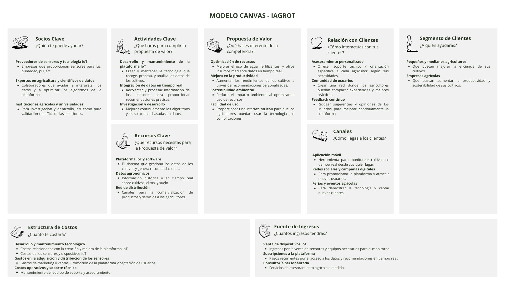

# Capítulo I: Introducción

## 1.1. Startup Profile

### 1.1.1. Descripción de la Startup

  

**IAgroT** surgió a partir de una necesidad identificada por un grupo de estudiantes de la Universidad Peruana de Ciencias Aplicadas, quienes se propusieron mejorar la eficiencia y sostenibilidad en la agricultura local. En su análisis, observaron que muchos agricultores carecían de acceso a tecnologías avanzadas que podrían optimizar la gestión de sus cultivos. Con este contexto en mente, se desarrolló una solución integral que combina dispositivos IoT con una aplicación móvil intuitiva, con el objetivo de transformar y modernizar la gestión agrícola.

- **Visión:** Ser líder en soluciones tecnológicas para la agricultura, empoderando a los agricultores con herramientas innovadoras que maximicen la productividad y promuevan prácticas sostenibles.

- **Misión:** Desarrollar y ofrecer dispositivos IoT accesibles y efectivos que permitan a los agricultores monitorear y optimizar el estado de sus cultivos en tiempo real, contribuyendo a una agricultura más eficiente y sostenible.

## 1.1.2. Perfiles de integrantes del equipo

<table>
  <tr>
    <td style="vertical-align: top; width: 40%;">
      Soy Lucas Benedetti Rivas, un joven de 24 años, estudiante del 8vo ciclo de la carrera de Ingeniería de Software en la Universidad Peruana de Ciencias Aplicadas. Además de mis estudios, me apasiona el desarrollo de aplicaciones web, actividad a la que dedico gran parte de mi tiempo libre. Profesionalmente, me desempeño como practicante en una entidad financiera, donde he tenido la oportunidad de aplicar metodologías ágiles y participar en la mejora continua de procesos críticos.
    </td>
    <td style="vertical-align: top; width: 60%;">
      
    </td>
  </tr>

  <tr>
    <td style="vertical-align: top; width: 40%;">
      Soy Jonatan Curi Montero, me encuentro estudiando la carrera de Ingeniería de Software en la Universidad Peruana de Ciencias Aplicadas. Poseo conocimientos en los lenguajes TypeScript y Javascript. También, en frameworks como Angular, Vue y .Net. Tengo experiencia en el desarrollo de aplicaciones web, enfocandome principalmente en el Frontend. Considero que la comunicación es una característica fundamental en el equipo de trabajo. Profesionalmente, me encuentro haciendo practicas en una empresa que brinda servicios de contabilidad y facturación electronica en aplicacion web.
    </td>
    <td style="vertical-align: top; width: 60%;">
      
    </td>
  </tr>
</table>

## 1.2. Solution Profile

### 1.2.1. Antecedentes y problemática

La agricultura en el Perú ha sido durante siglos una de las actividades económicas más importantes, empleando a un gran porcentaje de la población. Según la Encuesta Nacional de Hogares realizada en el 2022, 4,380,066 peruanos reportaron que su actividad económica principal era la agricultura. Sin embargo, esta actividad económica solo contribuye al 5.2% del PBI debido a la baja productividad. De hecho, en comparación con el resto de actividades económicas, este sector es el que muestra la menor productividad, con 6,7 miles de soles por empleo.

Parte de la causa de esta baja productividad se atribuye al impacto del fenómeno de El Niño y La Niña, que provoca alteraciones climáticas severas, afectando los ciclos de cultivo y disminuyendo la capacidad productiva de las tierras agrícolas. El Centro Nacional de Estimación, Prevención y Reducción del Riesgo de Desastres (Cenapred) realizó un pronóstico de riesgo de déficit hídrico debido a la temporada de lluvias 2023-2024. El informe estima un total de 1.9 millones de hectáreas de superficie agrícola expuestas a riesgo elevado, de las cuales 1.3 millones corresponden a riesgo muy alto. El departamento más afectado sería Cusco, con 330,762 hectáreas en riesgo, lo cual representa el 100% de la superficie agrícola en este departamento.

Además, las sequías pueden afectar gravemente a los cultivos de varias maneras, incluyendo la reducción de la superficie cultivada, la pérdida de cosechas, la disminución del trabajo asalariado, deterioro en la calidad de los suelos y nutrientes, causando desertificación, erosión y salinización. De acuerdo con el Ministerio de Desarrollo Agrario y Riego (Midagri), los departamentos que reportan más de la mitad de la superficie agrícola expuesta a riesgo elevado de sequías generaron el 78.2% de las toneladas producidas de trigo en 2022.

Finalmente, se presenta el enfoque estructurado 5W2H:

| **Pregunta** | **Respuesta**                                                                                                         |
|--------------|-----------------------------------------------------------------------------------------------------------------------|
| **Who (Quién)**  | Agricultores (4,380,066 peruanos reportaron que su actividad económica principal era la agricultura).                |
| **What (Qué)**   | Baja productividad en la agricultura peruana, contribuyendo solo al 5.2% del PBI.                                     |
| **When (Cuándo)** | Períodos en los que se producen cambios climáticos o fenómenos, como la temporada de lluvias 2023-2024.               |
| **Where (Dónde)** | En el Perú, mayormente en la sierra por consecuencia del bioma.                                                         |
| **Why (Por qué)** | Fenómeno de El Niño y La Niña que provoca alteraciones climáticas severas y sequías, afectando la agricultura.        |
| **How (Cómo)**    | Las hectáreas de superficie agrícola están expuestas a riesgo elevado, perdiendo la cosecha.                            |
| **How many (Cuántos)** | 1.9 millones de hectáreas en riesgo elevado, con 1.3 millones en riesgo muy alto. Además, los departamentos que reportan más de la mitad de la superficie agrícola en riesgo elevado generaron el 78.2% de las toneladas de trigo producidas en 2022. |

## 1.2.2 Lean UX Process

### 1.2.2.1. Lean UX Problem Statements

Hoy en día, los fenómenos climáticos extremos, como El Niño y La Niña, han afectado significativamente la agricultura en Perú, especialmente en regiones de la sierra. Los agricultores enfrentan problemas debido a la falta de herramientas integradas para monitorear y adaptarse a estas condiciones adversas. A menudo, los agricultores deben recurrir a métodos tradicionales y poco eficientes para gestionar el impacto climático en sus cultivos, lo que resulta en una baja productividad y una gestión deficiente de los recursos.

La pregunta clave para abordar este problema es: ¿Cómo podemos desarrollar una solución tecnológica que permita a los agricultores monitorear las condiciones climáticas en tiempo real y optimizar el uso de recursos, para mejorar la resiliencia y productividad de sus cultivos frente a fenómenos climáticos extremos?

Es crucial destacar que nuestro sistema se centrará en la gestión directa de las tareas agrícolas diarias, al proporcionar una plataforma de monitoreo, automatización y recomendación que se conecte con dispositivos IoT, mostrando mejoras en la eficiencia y producción agrícola.

### 1.2.2.2. Lean UX Assumptions

#### User Assumptions

- **¿Quiénes son nuestros usuarios?**
  - Agricultores: Buscan herramientas para mejorar la productividad de sus cultivos y optimizar el uso de recursos en un entorno climático cambiante.
  - Técnicos agrícolas: Necesitan datos precisos y en tiempo real para ofrecer recomendaciones basadas en las condiciones actuales y futuras.

- **¿Dónde encaja nuestro servicio para los usuarios?**
  - Nuestro servicio se integra en las operaciones diarias de los agricultores y técnicos, proporcionando herramientas para el monitoreo en tiempo real y la gestión de cultivos.

- **¿Qué problemas resuelve nuestro producto?**
  - Optimiza el uso de recursos como agua y nutrientes mediante datos en tiempo real y recomendaciones personalizadas.
  - Mejora la productividad de los cultivos al adaptar las prácticas agrícolas a las condiciones climáticas actuales y futuras.
  - Facilita la planificación y gestión de cultivos mediante el análisis de datos históricos y actuales.

- **¿Cuándo y cómo es usado nuestro producto?**
  - Nuestro producto es utilizado durante todo el ciclo de cultivo, desde la plantación hasta la cosecha.
  - Se usa a través de una plataforma tecnológica que proporciona datos en tiempo real y recomendaciones sobre la gestión de cultivos y recursos.

- **¿Qué características son importantes?**
  - La precisión y fiabilidad de los datos recopilados por los sensores y dispositivos IoT.
  - La facilidad de uso de la plataforma, con una interfaz intuitiva para acceder a datos y recomendaciones.
  - La capacidad de personalización para adaptarse a las necesidades específicas de diferentes tipos de cultivos y condiciones climáticas.

- **¿Cómo debe verse y comportarse nuestro producto?**
  - La plataforma debe ser visualmente clara y fácil de navegar, con un diseño que facilite el acceso rápido a la información relevante.
  - Debe transmitir confianza y seguridad, asegurando que los datos proporcionados sean precisos y útiles para la toma de decisiones.

#### Business Assumptions

- **Necesidad del mercado:**
  - Los agricultores tienen una necesidad urgente de herramientas que les ayuden a mejorar la productividad y gestionar recursos en un entorno climático incierto. Esto puede resultar en una mejora en la eficiencia y sostenibilidad de la agricultura.

- **Propuesta de valor:**
  - Nuestra solución tecnológica proporciona datos en tiempo real, recomendaciones personalizadas y automatizaciones que mejoran la gestión de cultivos y la eficiencia en el uso de recursos. Esto resulta en una mayor productividad y sostenibilidad.

- **Clientes iniciales:**
  - Agricultores que buscan optimizar sus prácticas agrícolas y técnicos agrícolas que necesitan herramientas para proporcionar recomendaciones basadas en datos precisos.

- **Valor principal para los clientes:**
  - La certeza de que los datos, recomendaciones y automatizaciones proporcionados por nuestra solución mejorarán la productividad de los cultivos y la gestión de recursos de manera efectiva.

- **Beneficios adicionales:**
  - Acceso a datos detallados y análisis sobre las condiciones de cultivo.
  - Mejora en la toma de decisiones y planificación basada en datos en tiempo real.
  - Mayor eficiencia en la gestión de recursos agrícolas.

- **Adquisición de clientes:**
  - A través de la promoción en redes sociales, colaboraciones con asociaciones agrícolas, y estrategias de marketing digital dirigidas a agricultores y técnicos.

- **Modelo de ingresos:**
  - Ventas directas de la solución tecnológica y suscripciones para acceder a datos y análisis avanzados.

- **Competencia:**
  - Otras soluciones tecnológicas para la gestión agrícola. Nos destacaremos ofreciendo una plataforma adaptada a las necesidades específicas de los agricultores y proporcionando datos y recomendaciones personalizadas.

- **Riesgos:**
  - La precisión de los datos recopilados por los sensores y la confiabilidad de la plataforma.

- **Indicadores de éxito:**
  - Aumento en el uso activo de la plataforma por parte de los agricultores.
  - Mejora en la productividad de los cultivos y en la gestión de recursos.
  - Satisfacción y fidelidad de los usuarios.

- **Supuestos críticos:**
  - Aceptación del mercado para la solución tecnológica.
  - Disposición de los usuarios a invertir en herramientas de monitoreo y gestión.
  - Capacidad de la plataforma para proporcionar datos precisos y útiles.

### 1.2.2.3. Lean UX Hypothesis Statements

- **Hipótesis 1:**
  - **Creemos que** nuestra solución tecnológica para la agricultura, que proporciona datos en tiempo real sobre humedad del suelo, temperatura y condiciones climáticas, mejorará la productividad de los cultivos al permitir una gestión más eficiente. **Sabremos que** hemos tenido éxito cuando al menos el 70% de los agricultores reporten un aumento en la productividad de sus cultivos y una reducción en el uso de recursos como agua y fertilizantes.

- **Hipótesis 2:**
  - **Creemos que** la integración de datos históricos y actuales para la planificación agrícola permitirá a los agricultores tomar decisiones más precisas y adaptarse mejor a las condiciones climáticas cambiantes. **Sabremos que** hemos tenido éxito cuando el 80% de los usuarios indiquen una mejora en la precisión de sus decisiones sobre siembra y cosecha, y una mayor adaptabilidad a las condiciones climáticas.

- **Hipótesis 3:**
  - **Creemos que** los problemas relacionados con la gestión ineficiente de plagas y enfermedades disminuirán si los agricultores tienen acceso a una plataforma que ofrezca recomendaciones predictivas basadas en inteligencia artificial. **Sabremos que** hemos tenido éxito cuando al menos el 75% de los agricultores reporten una reducción en las pérdidas por plagas y enfermedades y una mayor eficacia en el uso de tratamientos preventivos.

- **Hipótesis 4:**
  - **Creemos que** si ofrecemos una interfaz intuitiva y fácil de usar, que permita a los agricultores y técnicos acceder fácilmente a los datos y recomendaciones sin necesidad de capacitación extensiva. **Sabremos que** hemos tenido éxito cuando al menos el 80% de los usuarios indiquen que encuentran la plataforma fácil de usar y que un 75% de ellos la utilicen regularmente para la gestión de sus cultivos.

### 1.2.2.4. Lean UX Canvas

  

### 1.3. Segmentos objetivo

Nuestro segmento objetivo se compone de dos grupos clave:

- **Pequeños y Medianos Agricultores:** Agricultores que gestionan áreas de cultivo limitadas y que buscan optimizar el uso de sus recursos, como agua, fertilizantes y tiempo. Están motivados por la necesidad de aumentar la rentabilidad, reducir costos y acceder a tecnologías asequibles que les permitan mejorar la eficiencia y sostenibilidad de sus cultivos.

- **Grandes Empresas Agrícolas:** Empresas que gestionan extensas áreas de cultivo y que buscan implementar tecnologías avanzadas para maximizar la producción y la sostenibilidad. Están motivadas por la necesidad de gestionar eficientemente grandes volúmenes de datos agrícolas, optimizar el uso de recursos a gran escala, y cumplir con normativas ambientales, todo ello con el objetivo de mejorar su reputación y reducir costos operativos.
