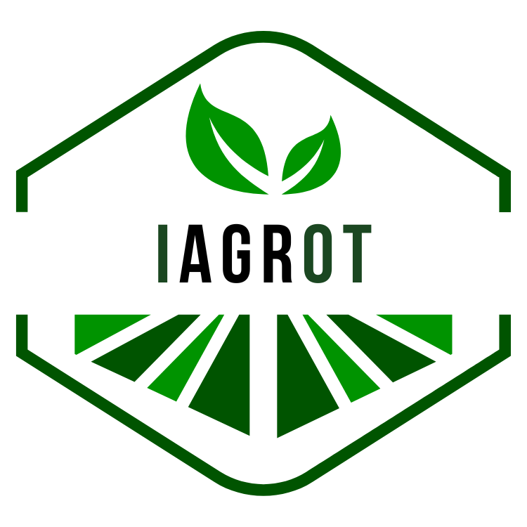

# Capítulo II: Requirements Elicitation & Analysis

## 2.1. Competidores

### 2.1.1. Análisis competitivo
<table>
<thead>
  <tr>
    <th colspan="7">Competitive Analysis Landscape</th>
  </tr>
</thead>
<tbody>
  <tr>
    <td colspan="3" rowspan="2">¿Por qué llevar a cabo este análisis? </td>
    <td colspan="4">¿Cómo identificar a nuestros principales competidores?</td>
  </tr>
  <tr>
    <td colspan="4">Este análisis permite realizar un estudio estratégico FODA, identificando las fortalezas, oportunidades, debilidades y amenazas de los competidores principales. Además, se evalúa su participación en el mercado y las estrategias necesarias para que nuestra aplicación se destaque en el entorno laboral. La identificación de los principales competidores se basa en un estudio de mercado que analiza las aplicaciones más utilizadas por los empleadores en el sector de la salud. Como resultado, se identificaron a los actores clave del mercado con los que competiremos directamente.</td>
  </tr>
  <tr>
    <td colspan="2" rowspan="5">(En la cabecera colocar por cada competidor nombre y logo)</td>
    <td colspan="2" rowspan="5">IAgroT
 

</td>
    <td rowspan="5">Farmers Edge
 

</td>
    <td rowspan="5">John Deere Operations Center
 

</td>
    <td rowspan="5">Climate FieldView
 

</td>
  </tr>
  <tr>
  </tr>
  <tr>
  </tr>
  <tr>
  </tr>
  <tr>
  </tr>
  <tr>
    <td rowspan="10">P E R F I L</td>
    <td rowspan="5">Overview</td>
    <td colspan="2" rowspan="5">Ofrecer tecnología IoT para el monitoreo en tiempo real de cultivos. Asimismo, una aplicación móvil para la gestión fácil y accesible de datos. Optimización y Recomendaciones para mejorar eficiencia y uso de insumos. Sostenibilidad para las prácticas agrícolas más sostenibles. Modernización y Transformación digital en la gestión agrícola.</td>
    <td rowspan="5">Soluciones de datos y analíticas para la agricultura de precisión mediante datos avanzados. Sensores IoT ya que se monitorea en tiempo real con estaciones meteorológicas y sensores de suelo. Software de gestión y optimización de cultivos y uso de insumos basado en datos.Imágenes satelitales para el monitoreo para detectar problemas y oportunidades en los cultivos.</td>
    <td rowspan="5">Plataforma IoT para la gestión de maquinaria agrícola y actividades de campo. Optimización de maquinaria y mejora de eficiencia y reducción de tiempos de inactividad. Integración de datos de sensores y GPS para una visión integral de las operaciones. Control de precisión y aplicación precisa de insumos como agua y fertilizantes.</td>
    <td rowspan="5">Plataforma digital para la agricultura basada en inteligencia artificial y modelos predictivos.Gestión de datos de cultivos, Visualización y análisis en tiempo real. Mapeo de rendimiento y evaluación de cómo responden los cultivos a las prácticas de gestión.Sensores y monitoreo en tiempo real de salud de cultivos y condiciones del suelo.</td>
  </tr>
  <tr>
  </tr>
  <tr>
  </tr>
  <tr>
  </tr>
  <tr>
  </tr>
  <tr>
    <td rowspan="5">Ventaja   competitiva  ¿Qué valor   ofrece a los   clientes? </td>
    <td colspan="2" rowspan="5">Ofrecer una solución más personalizada y fácil de usar. Proporcionar compatibilidad con diversas marcas y una opción más accesible. Asimismo, brindar un enfoque local y una integración más sencilla con diversos equipos agricolas.</td>
    <td rowspan="5"> <b>Solución integrada:</b> Combina sensores IoT, software y datos para una gestión agrícola personalizada.
<b>Imágenes satelitales:</b> Monitoreo constante para detectar problemas y oportunidades.
<b>Predicciones meteorológicas:</b> Datos locales para optimizar insumos y decisiones.</td>
    <td rowspan="5"><b>Integración con maquinaria:</b> Control preciso de maquinaria agrícola.
<b>Agricultura de precisión:</b> Uso avanzado de GPS y tecnología para gestionar operaciones de campo.
<b>Conectividad de equipos:</b> Plataforma única para gestionar todos los equipos John Deere.</td>
    <td rowspan="5"><b>Análisis predictivo:</b> IA para anticipar problemas y mejorar decisiones.
<b>Facilidad de uso:</b> Interfaz intuitiva para simplificar la gestión.
<b>Compatibilidad universal:</b> Integración con diversas marcas de maquinaria y sensores.</td>
  </tr>
  <tr>
  </tr>
  <tr>
  </tr>
  <tr>
  </tr>
  <tr>
  </tr>
  <tr>
    <td rowspan="21">P E R F I L       D E       M A R K E T I N G</td>
    <td rowspan="18">Mercado objetivo</td>
    <td colspan="2" rowspan="18">Desde pequeños hasta medianos productores que buscan modernizar y optimizar la gestión de sus cultivos. Asimismo, Grandes empresas agricolas.</td>
    <td rowspan="18">Agricultores medianos a grandes interesados en agricultura de precisión.</td>
    <td rowspan="18">Grandes productores con maquinaria John Deere o interesados en tecnología avanzada.</td>
    <td rowspan="18">Agricultores de todos tamaños buscando soluciones de datos flexibles.</td>
  </tr>
  <tr>
  </tr>
  <tr>
  </tr>
  <tr>
  </tr>
  <tr>
  </tr>
  <tr>
  </tr>
  <tr>
  </tr>
  <tr>
  </tr>
  <tr>
  </tr>
  <tr>
  </tr>
  <tr>
  </tr>
  <tr>
  </tr>
  <tr>
  </tr>
  <tr>
  </tr>
  <tr>
  </tr>
  <tr>
  </tr>
  <tr>
  </tr>
  <tr>
  </tr>
  <tr>
    <td rowspan="3">Estrategias de marketing</td>
    <td colspan="2" rowspan="3"><b>Marketing Digital:</b> Campañas dirigidas en redes sociales y sitios web para destacar la facilidad de uso y beneficios.
<b>Alianzas Locales:</b> Colaboraciones con distribuidores y proveedores locales para aumentar la visibilidad.</td>
    <td rowspan="3"><b>Colaboraciones:</b> Alianzas con proveedores de tecnología y distribuidores para ampliar su alcance.
<b>Marketing basado en datos:</b> Campañas dirigidas a agricultores con tecnología avanzada.</td>
    <td rowspan="3"><b>Eventos y ferias:</b> Participación en ferias agrícolas y tecnológicas globales.
<b>Marketing digital:</b> Contenido técnico y guías sobre innovación y eficiencia operativa.</td>
    <td rowspan="3"><b>Marketing digital:</b> Campañas en redes sociales destacando la facilidad de uso y compatibilidad.
<b>Pruebas gratuitas:</b> Ofrecen demos y pruebas gratuitas para atraer usuarios.
<b>Partnerships:</b> Alianzas con fabricantes para integrar sus tecnologías. </td>
  </tr>
  <tr>
  </tr>
  <tr>
  </tr>
  <tr>
    <td rowspan="25">P E R F I L  D E  P R O D U C T O</td>
    <td rowspan="15">Productos &amp;   Servicios </td>
    <td colspan="2" rowspan="15"><b>Producto</b>
Dispositivos IoT: Sensores para monitoreo de condiciones de cultivo (como humedad, temperatura, etc.) en tiempo real.
<b>Servicio</b>
Aplicación Móvil: Plataforma para gestionar datos de cultivos, recibir alertas, y optimizar el uso de insumos. Incluye soporte y capacitación para el uso de la tecnología.</td>
    <td rowspan="15"><b>Productos:</b> Sensores IoT, estaciones meteorológicas, imágenes satelitales.
<b>Servicios:</b> Monitoreo de cultivos en tiempo real, análisis de datos personalizados, predicciones meteorológicas locales, recomendaciones de gestión de cultivos.</td>
    <td rowspan="15"><b>Productos:</b> Maquinaria agrícola con tecnología de precisión (tractores, cosechadoras, sembradoras), sensores y GPS.
<b>Servicios:</b> Monitoreo y gestión de maquinaria, mapas de rendimiento, integración de datos de campo, control de operaciones de agricultura de precisión. </td>
    <td rowspan="15"><b>Productos:</b> Plataforma digital de gestión agrícola, sensores de campo.
<b>Servicios:</b> Gestión de datos de cultivos, mapeo de rendimiento, análisis predictivo, monitoreo en tiempo real de condiciones del campo, integración con múltiples tipos de maquinaria. </td>
  </tr>
  <tr>
  </tr>
  <tr>
  </tr>
  <tr>
  </tr>
  <tr>
  </tr>
  <tr>
  </tr>
  <tr>
  </tr>
  <tr>
  </tr>
  <tr>
  </tr>
  <tr>
  </tr>
  <tr>
  </tr>
  <tr>
  </tr>
  <tr>
  </tr>
  <tr>
  </tr>
  <tr>
  </tr>
  <tr>
    <td rowspan="7">Precios y Costos</td>
    <td colspan="2" rowspan="7">Ofrecer tarifas mensuales o anuales para el acceso a la aplicación móvil y servicios de soporte. Y el costo por dispositivo precio unitario para los dispositivos IoT, con opción de descuento por compras en volumen. </td>
    <td rowspan="7">Generalmente, entre $2,000 y $5,000 USD por año, dependiendo del tamaño de la operación y los servicios contratados.</td>
    <td rowspan="7">Costos de suscripción a la plataforma pueden estar en el rango de $1,000 a $3,000 USD anuales, a menudo incluidos con la compra de maquinaria o como parte de un paquete de servicios.</td>
    <td rowspan="7">Aproximadamente $1,000 a $2,500 USD por año, según el tamaño del campo y las características del servicio.</td>
  </tr>
  <tr>
  </tr>
  <tr>
  </tr>
  <tr>
  </tr>
  <tr>
  </tr>
  <tr>
  </tr>
  <tr>
  </tr>
  <tr>
    <td rowspan="3">Canales de   distribución   (Web y/o Móvil) </td>
    <td colspan="2" rowspan="3">Web y Móvil</td>
    <td rowspan="3">Web y Móvil</td>
    <td rowspan="3">Web</td>
    <td rowspan="3">Web</td>
  </tr>
  <tr>
  </tr>
  <tr>
  </tr>
  <tr>
    <td rowspan="21">A N Á L I S I S  S W O T</td>
    <td colspan="6" rowspan="10">Realice esto para su startup y sus competidores. Sus fortalezas deberían apoyar sus oportunidades y contribuir a lo que ustedes definen como su posible ventaja competitiva.</td>
  </tr>
  <tr>
  </tr>
  <tr>
  </tr>
  <tr>
  </tr>
  <tr>
  </tr>
  <tr>
  </tr>
  <tr>
  </tr>
  <tr>
  </tr>
  <tr>
  </tr>
  <tr>
  </tr>
  <tr>
    <td rowspan="5">Fortalezas</td>
    <td colspan="2" rowspan="5">Innovación con IoT y app intuitiva.
Adaptable a varias marcas y fácil de usar.
Enfoque en necesidades locales.</td>
    <td rowspan="5">Solución integral de datos y sensores IoT.
Imágenes satelitales para monitoreo avanzado.</td>
    <td rowspan="5">Marca establecida y reconocida en maquinaria agrícola.
Integración completa con maquinaria John Deere.</td>
    <td rowspan="5">Plataforma flexible y compatible con múltiples marcas de maquinaria.
Análisis predictivo y gestión de datos avanzada.</td>
  </tr>
  <tr>
  </tr>
  <tr>
  </tr>
  <tr>
  </tr>
  <tr>
  </tr>
  <tr>
    <td rowspan="2">Debilidades</td>
    <td colspan="2" rowspan="2">Costo inicial puede ser un obstáculo.
Desafíos en la adopción por parte de agricultores no tecnológicos.
Requiere datos y comunicación fiables.</td>
    <td rowspan="2">Costos relativamente altos para algunos agricultores.
Dependencia de la tecnología y datos precisos.</td>
    <td rowspan="2">Enfoque limitado a maquinaria John Deere puede limitar su mercado.
Costos elevados de maquinaria.</td>
    <td rowspan="2">Dependencia de la integración con diferentes equipos y tecnologías.
Puede ser percibido como menos especializado en comparación con competidores enfocados en maquinaria.</td>
  </tr>
  <tr>
  </tr>
  <tr>
    <td rowspan="3">Oportunidades</td>
    <td colspan="2" rowspan="3">Creciente demanda de tecnología agrícola.
Potencial de expansión regional.</td>
    <td rowspan="3">Expansión a nuevos mercados agrícolas.
Crecimiento en la demanda de soluciones de agricultura de precisión.</td>
    <td rowspan="3">Innovación continua en tecnologías de precisión.
Expansión de la conectividad y servicios digitales.</td>
    <td rowspan="3">Creciente interés en soluciones basadas en datos y analíticas.
Expansión en mercados internacionales.</td>
  </tr>
  <tr>
  </tr>
  <tr>
  </tr>
  <tr>
    <td>Amenazas</td>
    <td colspan="2">Competencia fuerte de empresas establecidas.
Rápidos avances tecnológicos.
Impacto de fluctuaciones económicas en el presupuesto agrícola.</td>
    <td>Competencia creciente en el mercado de agricultura de precisión. Variabilidad en la aceptación de tecnología por parte de agricultores tradicionales.</td>
    <td>Alta competencia de otras marcas de maquinaria y soluciones digitales. Cambios en la demanda de maquinaria agrícola de gran escala.</td>
    <td>Competencia de plataformas que ofrecen soluciones integradas o específicas de maquinaria.
Rápido avance tecnológico que puede hacer que la plataforma quede obsoleta.</td>
  </tr>
</tbody>
</table>

### 2.1.2. Estrategias y tácticas frente a competidores

### Estrategia: Reforzamiento de la Marca
**Táctica:** Dado que **IAgroT** tiene una misión clara de mejorar la eficiencia agrícola a través de la tecnología, crearemos campañas de marketing que destaquen casos de éxito reales de agricultores que han utilizado nuestra solución. Utilizaremos estos testimonios y estudios de caso en nuestros materiales promocionales para construir credibilidad y reforzar la identidad de marca como líder en tecnología agrícola.

### Estrategia: Innovación en Producto
**Táctica:** Blindaremos nuestra marca bajo el marco del uso de nuevas funcionalidades que integren tecnologías emergentes, como inteligencia artificial para análisis predictivo de cultivos, o el uso de drones para monitoreo remoto.

### Estrategia: Posicionamiento Competitivo
**Táctica:** A partir del análisis FODA realizado en el capítulo de requisitos, enfocaremos nuestros esfuerzos en comunicar las fortalezas de nuestra solución frente a los competidores en nuestros canales de marketing. Por ejemplo, si uno de los puntos fuertes identificados es la usabilidad superior de nuestra aplicación, desarrollaremos demostraciones en vivo, tutoriales en video y webinars para mostrar esta ventaja.

### Estrategia: Pricing Competitivo
**Táctica:** El análisis competitivo muestra que nuestros competidores tienen precios más bajos pero menos funcionalidades, desarrollaremos una estrategia de precios que ofrezca más valor por un precio similar o desarrollar versiones del producto más accesibles para pequeñas y medianas empresas agrícolas que no necesitan todas las funcionalidades avanzadas.

### Estrategia: Colaboración con Instituciones Educativas
**Táctica:** Aprovechando la conexión con la UPC, estableceremos colaboraciones para desarrollar nuevas investigaciones o programas educativos que utilicen nuestra tecnología propuesta. Esto no solo podría mejorar nuestro producto sino también establecer a **IAgroT** como un referente en la innovación tecnológica en la agricultura.

## 2.2. Entrevistas

### 2.2.1. Diseño de entrevistas

#### Preguntas Generales

- ¿Cuál es su nombre y apellido?
- ¿Cuántos años de experiencia tiene en la agricultura?
- ¿Cuántas hectáreas de terreno agrícola maneja actualmente?
- ¿Cuál es el principal tipo de cultivo que siembra en su terreno?
- ¿Qué porcentaje de sus cultivos se destina a consumo local versus exportación?

#### Preguntas para Pequeños y Medianos Agricultores

- ¿Cuáles son los principales desafíos que enfrentan en la gestión de sus cultivos actualmente?
- ¿Cómo miden actualmente la eficiencia de su uso de recursos como agua y fertilizantes?
- ¿Utilizan alguna tecnología o herramienta específica para optimizar la gestión de sus recursos?
- ¿Qué tan interesados estarían en una solución que les permita monitorear sus cultivos en tiempo real?
- ¿Qué nivel de inversión estarían dispuestos a hacer en tecnologías que podrían optimizar la gestión de sus cultivos?
- ¿Qué tipo de soporte o formación necesitarían para adoptar una solución tecnológica como la que ofrecemos?
- ¿Cuáles son sus principales preocupaciones respecto a la adopción de nuevas tecnologías?
- ¿Qué tipo de resultados o beneficios esperarían ver después de implementar una solución tecnológica en sus cultivos?

#### Preguntas para Grandes Empresas Agrícolas

- ¿Cuáles son los principales desafíos que enfrentan en la gestión de extensas áreas de cultivo?
- ¿Qué tipo de tecnologías agrícolas utilizan actualmente para optimizar la producción y sostenibilidad?
- ¿Cómo gestionan los grandes volúmenes de datos agrícolas que generan sus operaciones?
- ¿Qué tan importante es para su empresa la implementación de tecnologías avanzadas?
- ¿Cómo influyen las normativas ambientales en sus decisiones sobre la implementación de nuevas tecnologías?
- ¿Qué tipo de retorno de inversión esperan al implementar nuevas soluciones tecnológicas?
- ¿Qué valoraría más su empresa en una solución de monitoreo en tiempo real para cultivos?
- ¿Qué desafíos han enfrentado con las tecnologías agrícolas actuales y cómo los han superado?

### 2.2.2. Registro de entrevistas

#### Entrevista 1: Agricultor Pequeño

Entrevistado: Eleuterio Chavez

Entrevistador: Jonatan Curi

Url: https://upcedupe-my.sharepoint.com/:v:/g/personal/u201912404_upc_edu_pe/EUr0HsmmyfJGiPm4oNqo54EB8WkXYOJzNxLEA43BolbZOQ?e=S3XuoT&nav=eyJyZWZlcnJhbEluZm8iOnsicmVmZXJyYWxBcHAiOiJTdHJlYW1XZWJBcHAiLCJyZWZlcnJhbFZpZXciOiJTaGFyZURpYWxvZy1MaW5rIiwicmVmZXJyYWxBcHBQbGF0Zm9ybSI6IldlYiIsInJlZmVycmFsTW9kZSI6InZpZXcifX0%3D

Evidencia de la reunión

Resumen: En la entrevista, se habló sobre la idea de IAgroT, una solución para optimizar la gestión agrícola mediante IoT y una aplicación móvil. Eleuterio Chávez, un agricultor con una hectárea de cultivos, comentó que su mayor desafío es la sequedad estacional y la falta de un sistema eficiente de riego, ya que no utiliza tecnología y se basa en su experiencia. Se discutió cómo IAgroT podría ayudar, pero Eleuterio mencionó que la mayor limitación sería la distancia para monitorear los cultivos, debido a la falta de wifi y la limitada cobertura de bluetooth, expresando su interés en una solución que no dependa de estos.

#### Entrevista 2: Agricultora Pequeño

Entrevistado: Nikole Garcia

Entrevistador: Willy Valentin

Url: https://upcedupe-my.sharepoint.com/:v:/g/personal/u20201c037_upc_edu_pe/EXcMbCkdzY1Dj1TlIyGAiY4BOL6CMSP2TeND6i_W4yVPqQ?e=xeb7n9&nav=eyJyZWZlcnJhbEluZm8iOnsicmVmZXJyYWxBcHAiOiJTdHJlYW1XZWJBcHAiLCJyZWZlcnJhbFZpZXciOiJTaGFyZURpYWxvZy1MaW5rIiwicmVmZXJyYWxBcHBQbGF0Zm9ybSI6IldlYiIsInJlZmVycmFsTW9kZSI6InZpZXcifX0%3D

Evidencia de la reunión

Resumen: Nikole Garcia, con 5 años de experiencia en la agricultura y propietaria de 5 hectáreas de arroz, comentó en la entrevista que le gustaría implementar soluciones tecnológicas para mejorar la supervisión de sus cultivos, especialmente en el control de plagas y la gestión de cambios de humedad y condiciones climáticas. Aunque actualmente no utiliza tecnología para estos fines, expresó su interés en herramientas que le permitan un monitoreo eficiente y remoto de sus tierras. Sin embargo, resaltó que la solución debe ser accesible y adaptable, dado que en algunas áreas de su terreno la conectividad es limitada.

#### Entrevista 3: Agricultora Pequeño

Entrevistado: Diego Merino

Entrevistador: Clara Valverde 

Url: https://youtu.be/knHeN7ZoThU

Evidencia de la reunión

Resumen: Diego Merino, enfrentan desafíos significativos en cuanto al acceso a recursos como agua y fertilizantes, además de las condiciones climáticas cambiantes. Aunque utilizan métodos tradicionales para la gestión de cultivos, muestran interés en soluciones tecnológicas que les ayuden a monitorear sus cultivos en tiempo real, siempre y cuando el costo sea accesible y reciban una capacitación adecuada. Las principales preocupaciones se centran en la inversión inicial y la facilidad de uso de la tecnología. Los beneficios esperados incluyen una mayor eficiencia en el uso de recursos y mejores rendimientos agrícolas. Esta información sugiere que el desarrollo de soluciones tecnológicas para agricultores de pequeña y mediana escala debería enfocarse en la simplicidad de uso, accesibilidad económica y soporte técnico detallado para asegurar su adopción.

### 2.2.3. Análisis de entrevistas

En las entrevistas, tanto Eleuterio Chávez como Nikole García identificaron la falta de conectividad y el manejo de recursos como sus principales desafíos en la gestión de sus cultivos. Eleuterio destacó la dificultad para implementar un sistema de riego eficiente debido a la sequedad estacional y la falta de tecnología en su terreno de una hectárea. A su vez, Nikole expresó interés en el uso de tecnología para mejorar el control de plagas y la supervisión climática en sus cinco hectáreas de arroz, aunque resaltó la necesidad de que las soluciones sean accesibles y funcionen en áreas con conectividad limitada.
Ambos agricultores mostraron apertura hacia la implementación de soluciones tecnológicas, siempre y cuando estas se adapten a sus condiciones locales. La propuesta de IAgroT podría optimizar el riego y monitoreo remoto de los cultivos, pero para ser viable deberá prescindir de tecnologías que dependan de wifi o Bluetooth, ofreciendo una opción más accesible y adaptable que permita gestionar las áreas rurales de manera eficiente.

## 2.3. Needfinding
### 2.3.1. User Personas

A continuación, se construirán los User Persona de cada segmento objetivo de nuestra aplicación. Para ello, se utilizarán los datos recolectados de las entrevistas realizadas; principalmente, los que muestran los objetivos, motivaciones y frustraciones con las que cuentan cada uno de los sectores que conforman al público al que va dirigida la aplicación. Es decir, se presentará tanto un estereotipo de un agricultor como el de un de un técnico agrícola. 

### User Persona – Agricultor 

### User Persona – Técnico agrícola 

### 2.3.2. User Task Matrix
### María Pineda - User Task Matrix

| **Descripción**                                      | **Importancia** | **Frecuencia** |
|------------------------------------------------------|-----------------|----------------|
| Supervisar el estado de los cultivos                 | Alta            | Siempre        |
| Preparar el terreno para la siembra                  | Alta            | Siempre        |
| Monitorear las condiciones climáticas                | Alta            | Siempre        |
| Regar los cultivos manualmente o con sistemas simples| Media           | A menudo       |
| Aplicar fertilizantes o pesticidas                   | Alta            | A menudo       |
| Revisar los precios de mercado                       | Media           | A menudo       |
| Buscar nuevas técnicas de cultivo                    | Alta            | A menudo       |
| Vender productos en el mercado local                 | Alta            | A menudo       |
| Colaborar con otros agricultores                     | Media           | A veces        |
| Consultar expertos agrícolas o técnicos              | Media           | A veces        |
| Transportar productos a la ciudad                    | Media           | A veces        |
| Hacer mantenimiento a herramientas agrícolas         | Baja            | A veces        |
| Gestionar el financiamiento agrícola                 | Alta            | Rara vez       |
| Participar en capacitaciones sobre nuevas tecnologías| Alta            | Rara vez       |

### 2.3.3 User Journey Mapping

El User Journey Mapping es una herramienta de Design Thinking que nos ayuda a graficar un mapa con las etapas, canales, elementos e interacciones por las que pasa nuestro usuario durante el ciclo de uso del servicio.  

### User Journey Mapping – Agricultor 

### User Journey Mapping – Técnico agrícola 

### 2.3.4. Empathy Mapping 

### 2.3.5. As-is Scenario Mapping

## Ubiquitous Language

- **Climate Resilience (Resiliencia Climática)**  
  Capacidad de los agricultores y sus cultivos para adaptarse y recuperarse de los efectos adversos del cambio climático y condiciones meteorológicas extremas.

- **Crop Health Monitoring (Monitoreo de la Salud del Cultivo)**  
  Uso de sensores para observar el estado de los cultivos y detectar plagas, enfermedades o deficiencias nutricionales de manera temprana.

- **Data-Driven Decision Making (Toma de Decisiones Basada en Datos)**  
  Proceso de usar datos recopilados a través de sensores IoT para ajustar las prácticas agrícolas, optimizando el uso de recursos y mejorando el rendimiento de los cultivos.

- **Drought (Sequía)**  
  Periodo prolongado de tiempo con escasez de agua que afecta gravemente la producción agrícola, reduciendo la superficie cultivada y provocando la pérdida de cosechas.

- **El Niño Phenomenon (Fenómeno de El Niño)**  
  Fenómeno climático caracterizado por un calentamiento anormal de las aguas del océano Pacífico, que provoca alteraciones meteorológicas significativas, como lluvias intensas y sequías, afectando gravemente la agricultura, especialmente en la costa del Perú.

- **IoT (Internet of Things) (Internet de las Cosas)**  
  Conjunto de dispositivos conectados entre sí mediante internet, que recopilan y comparten datos en tiempo real sobre las condiciones del entorno agrícola, como humedad del suelo y temperatura.

- **La Niña Phenomenon (Fenómeno de La Niña)**  
  Fenómeno climático opuesto a El Niño, marcado por un enfriamiento anormal de las aguas del océano Pacífico, causando sequías extremas en algunas regiones y lluvias excesivas en otras, alterando los ciclos de cultivo.

- **Precision Agriculture (Agricultura de Precisión)**  
  Enfoque basado en el uso de tecnologías avanzadas para gestionar y ajustar el riego, fertilización y control de plagas según las condiciones exactas de cada área del cultivo.

- **Real-Time Monitoring (Monitoreo en Tiempo Real)**  
  Capacidad de observar y analizar continuamente datos actualizados del estado de los cultivos y el clima, permitiendo a los agricultores tomar decisiones informadas de forma inmediata.

- **Risk Management (Gestión de Riesgos)**  
  Estrategias implementadas para mitigar el impacto de fenómenos climáticos extremos, como sequías o inundaciones, sobre la productividad agrícola.

- **Smart Agriculture (Agricultura Inteligente)**  
  Uso de tecnología avanzada, como sensores y dispositivos conectados, para monitorear y gestionar los cultivos, optimizando el uso de recursos y aumentando la productividad.

- **Soil Moisture Sensor (Sensor de Humedad del Suelo)**  
  Dispositivo que mide la cantidad de agua en el suelo y envía estos datos a la plataforma de monitoreo para ajustar el riego de los cultivos de forma eficiente.

- **Sustainability (Sostenibilidad)**  
  Prácticas agrícolas que buscan mantener la productividad del suelo y reducir el impacto ambiental, promoviendo un equilibrio entre la producción actual y el bienestar futuro de la tierra.

- **Yield Optimization (Optimización de la Cosecha)**  
  Procesos y tecnologías que permiten aumentar la productividad de los cultivos a través de un uso más eficiente de los recursos como el agua, nutrientes y tiempo.
