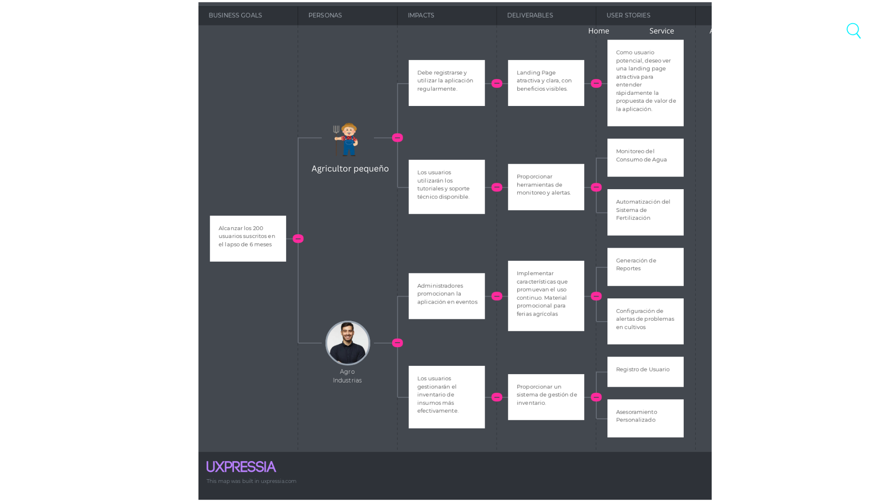

# Capítulo III: Requirements Specification

## 3.1. To-Be Scenario Mapping

## 3.2. User Stories
### User Stories

| Epic / Story ID | Título                                                   | Descripción                                                                                           | Criterios de Aceptación | Relacionado con (Epic ID) |
|------------------|---------------------------------------------------------|-------------------------------------------------------------------------------------------------------|--------------------------|----------------------------|
| EP1              | Landing Page                                           | Como usuario potencial, quiero ver una landing page atractiva para entender rápidamente la propuesta de valor de la aplicación. | Escenario: Carga de Landing Page: Dado que el usuario accede a la landing page, Cuando se carga correctamente, Entonces se visualizan los elementos clave y el mensaje de bienvenida. Escenario: Errores en la Carga: Dado que el usuario accede a la landing page, Cuando hay un error en la carga, Entonces se muestra un mensaje de error. | -                          |
| EP2              | Registro y Autenticación                               | Como usuario, quiero registrarme e iniciar sesión en la aplicación para acceder a funcionalidades personalizadas. | -                        | -                          |
| EP3              | Monitoreo de Cultivos                                  | Como agricultor, quiero monitorear el estado de mis cultivos a través de la aplicación para tomar decisiones informadas. | -                        | -                          |
| EP4              | Gestión de Recursos Hídricos                           | Como agricultor, quiero gestionar el consumo de agua en mi finca para optimizar el uso de recursos hídricos. | -                        | -                          |
| EP5              | Gestión de Insumos Agrícolas                           | Como administrador de una agroindustria, quiero gestionar el inventario de insumos agrícolas para evitar escasez o exceso de materiales. | -                        | -                          |
| US 1             | Landing Page                                           | Como usuario potencial, quiero ver una landing page atractiva para entender rápidamente la propuesta de valor de la aplicación. | Escenario: Carga de Landing Page: Dado que el usuario accede a la landing page, Cuando se carga correctamente, Entonces se visualizan los elementos clave y el mensaje de bienvenida. Escenario: Errores en la Carga: Dado que el usuario accede a la landing page, Cuando hay un error en la carga, Entonces se muestra un mensaje de error. | EP1                        |
| US 2             | Información sobre Funcionalidades                     | Como visitante de la landing page, quiero ver un resumen de las funcionalidades de la aplicación para entender qué ofrece. | Escenario: Funcionalidades Visibles: Dado que el usuario está en la landing page, Cuando se visualizan las funcionalidades, Entonces se muestran claramente los beneficios de cada una. | EP1                        |
| US 3             | Testimonios de Usuarios                                | Como visitante de la landing page, quiero leer testimonios de otros usuarios para confiar en la aplicación. | Escenario: Testimonios Cargados: Dado que el usuario está en la landing page, Cuando se cargan los testimonios, Entonces se muestran varios comentarios de usuarios satisfechos. | EP1                        |
| US 4             | Llamada a la Acción                                    | Como visitante de la landing page, quiero encontrar una clara llamada a la acción para registrarme o descargar la aplicación. | Escenario: CTA Visible: Dado que el usuario está en la landing page, Cuando se encuentra con la llamada a la acción, Entonces se puede hacer clic y redirige a la página de registro. | EP1                        |
| US 5             | Registro de Usuario                                     | Como usuario nuevo, quiero poder registrarme en la aplicación móvil para crear una cuenta y acceder a las funcionalidades del sistema. | Escenario: Registro Fallido: Dado que el usuario está en la pantalla de registro, Cuando ingresa datos inválidos, Entonces se muestra un mensaje de error. Escenario: Registro Exitoso: Dado que el usuario está en la pantalla de registro, Cuando ingresa datos válidos, Entonces se crea la cuenta y el usuario es redirigido a la pantalla de inicio de sesión. | EP2                        |
| US 6             | Inicio de Sesión                                       | Como usuario registrado, quiero iniciar sesión en la aplicación móvil para acceder a mis datos y funcionalidades personalizadas. | Escenario: Datos Incorrectos: Dado que el usuario está en la pantalla de inicio de sesión, Cuando ingresa datos incorrectos, Entonces se muestra un mensaje de error. Escenario: Inicio de Sesión Exitoso: Dado que el usuario está en la pantalla de inicio de sesión, Cuando ingresa datos correctos, Entonces el usuario es redirigido a la página principal. | EP2                        |
| US 7             | Visualización de Datos en Tiempo Real                   | Como usuario de la aplicación, quiero visualizar los datos en tiempo real recolectados por el dispositivo IoT para monitorear el estado actual de mis cultivos. | Escenario: Datos No Actualizados: Dado que el usuario está en la pantalla de visualización de datos, Cuando los datos no se actualizan, Entonces se muestra un mensaje de error o una notificación de que los datos están desactualizados. Escenario: Datos Actualizados: Dado que el usuario está en la pantalla de visualización de datos, Cuando los datos se actualizan en tiempo real, Entonces se muestran los datos correctos y actualizados en la pantalla. | EP3                        |
| US 8             | Generación de Reportes                                  | Como usuario, quiero generar reportes detallados sobre el estado de mis cultivos y el uso de recursos, para analizar la información histórica y tomar decisiones informadas. | Escenario: Reportes No Generados: Dado que el usuario está en la pantalla de generación de reportes, Cuando el reporte no se genera correctamente, Entonces se muestra un mensaje de error y se proporciona asistencia. Escenario: Reportes Generados: Dado que el usuario está en la pantalla de generación de reportes, Cuando el reporte se genera correctamente, Entonces el usuario puede descargarlo o visualizarlo en diferentes formatos. | EP3                        |
| US 9             | Configuración de alertas de problemas en cultivos       | Como agricultor, quiero configurar alertas para problemas potenciales en mis cultivos, como plagas, para poder actuar rápidamente y mitigar daños. | Escenario: Configuración incorrecta: Dado que el usuario está configurando alertas, Cuando se ingresan datos incorrectos o incompletos, Entonces se muestra un mensaje de error y se solicita corregir la configuración. Escenario: Configuración correcta: Dado que el usuario está configurando alertas, Cuando se ingresan todos los datos correctamente, Entonces el sistema guarda la configuración y está listo para enviar alertas cuando se detecten problemas. | EP3                        |
| US 10            | Notificación de mantenimiento preventivo                 | Como agricultor, quiero recibir notificaciones de mantenimiento preventivo para el dispositivo IoT, para asegurar su funcionamiento continuo y evitar fallos. | Escenario: Mantenimiento Programado: Dado que el dispositivo necesita mantenimiento, Cuando se acerca la fecha programada, Entonces el sistema envía notificación al usuario para realizar el mantenimiento. | EP3                        |
| US 11            | Simulación de Impacto Climático en los Cultivos        | Como usuario, quiero simular diferentes escenarios climáticos para predecir el impacto en mis cultivos y tomar decisiones preventivas. | Escenario: Simulación No Funcional: Dado que el usuario intenta realizar una simulación, Cuando la simulación no funciona, Entonces se muestra un mensaje de error y se sugiere intentar nuevamente. Escenario: Simulación Completa: Dado que el usuario realiza una simulación, Cuando la simulación se completa exitosamente, Entonces se muestran los resultados y recomendaciones basadas en el análisis. | EP3                        |
| US 12            | Automatización del Sistema de Fertilización             | Como agricultor, quiero tener un sistema de automatización de fertilización basado en los datos del dispositivo IoT para optimizar el uso de fertilizantes. | Escenario: Fertilización Ineficiente: Dado que el sistema de fertilización está en uso, Cuando el sistema no aplica la cantidad correcta de fertilizante, Entonces se ajustan las configuraciones para mejorar la eficiencia. Escenario: Fertilización Óptima: Dado que el sistema de fertilización está en uso, Cuando el sistema aplica la cantidad correcta de fertilizante, Entonces se mejora la salud del cultivo y se optimizan los recursos. | EP4                        |
| US 13            | Acceso a Tutoriales y Soporte Técnico                  | Como usuario, quiero tener acceso a tutoriales y soporte técnico para entender mejor cómo usar todas las funcionalidades de la aplicación. | Escenario: Tutoriales Inaccesibles: Dado que el usuario intenta acceder a un tutorial, Cuando no puede acceder al tutorial, Entonces se muestra un mensaje de error y se ofrece un apartado de soporte técnico. Escenario: Acceso a Tutoriales: Dado que el usuario intenta acceder a un tutorial, Cuando puede acceder al tutorial, Entonces se proporciona el contenido del tutorial en un formato comprensible. | EP2                        |
| US 14            |  Registro y Monitoreo de Cosechas                        | Como agricultor, quiero poder registrar y monitorear la información sobre los cultivos actuales en mi campo para realizar un seguimiento del estado y las condiciones de la cosecha. | Escenario: Dado que el usuario ha iniciado sesión en la aplicación, cuando selecciona la opción de registro de cultivos, entonces puede ingresar los datos del tipo de cultivo, fecha de siembra, estado actual y condiciones de crecimiento.
Escenario: Dado que el usuario ha ingresado los datos del cultivo, cuando accede a la sección de monitoreo de cosechas, entonces se muestran las actualizaciones del crecimiento y las recomendaciones basadas en las condiciones actuales del campo. | EP3                        |
| US 15            | Monitoreo del Consumo de Agua                           | Como agricultor, quiero monitorear el consumo de agua en mi finca para optimizar el uso de recursos hídricos. | Escenario: Datos de Consumo Incorrectos: Dado que el usuario está en la pantalla de monitoreo, Cuando el consumo de agua no se muestra correctamente, Entonces se presenta un mensaje de error. Escenario: Datos de Consumo Correctos: Dado que el usuario está en la pantalla de monitoreo, Cuando el consumo de agua se muestra correctamente, Entonces se visualiza la información en tiempo real. | EP4                        |
| US 16            | Integración con Dispositivos IoT                        | Como agricultor, quiero integrar mis dispositivos IoT con la aplicación para recibir datos de manera centralizada. | Escenario: Integración Fallida: Dado que el usuario intenta integrar un dispositivo, Cuando la integración falla, Entonces se muestra un mensaje de error. Escenario: Integración Exitosa: Dado que el usuario integra un dispositivo, Cuando la integración es exitosa, Entonces se muestran los datos del dispositivo en la aplicación. | EP3                        |
| US 17            | Integración de Noticias Agrícolas                           | Como usuario de la aplicación, quiero ver noticias relevantes sobre agricultura para mantenerme informado sobre las últimas tendencias y avances tecnológicos. | Dado que el usuario ha iniciado sesión en la aplicación, cuando selecciona la opción de noticias, entonces se muestra una lista de noticias actualizadas relacionadas con la agricultura. | EP3                        |
| TS1              | Exposición de RESTful API        | Como desarrollador, necesito exponer una API RESTful para que la aplicación pueda interactuar con los datos de manera eficiente. | Escenario: Creación de Endpoint: Dado que el desarrollador crea un endpoint, Cuando se solicita el endpoint, Entonces se devuelve un código de estado 200 con los datos esperados. Escenario: Manejo de Errores: Dado que el endpoint recibe un request inválido, Cuando se produce un error, Entonces se devuelve un código de estado 400 con un mensaje de error descriptivo. | -                          |
| TS 2             | Integración de Registro y Autenticación                | Como Developer, debo implementar el backend para el registro y autenticación de usuarios, asegurando que los datos sean encriptados. | Escenario: Registro Exitoso: Dado que se envían datos válidos, Cuando se completa el registro, Entonces se devuelve un token de sesión. Escenario: Registro Fallido: Dado que se envían datos inválidos, Cuando se intenta registrar, Entonces se devuelve un error 400. | -                      |

## 3.3. Impact Mapping
   

## 3.4. Product Backlog

| Orden | User Story ID | Título                                       | Descripción                                                                             | Story Points |
|-------|---------------|---------------------------------------------|-----------------------------------------------------------------------------------------|--------------|
| 1     | US1           | Landing Page                                | Como usuario potencial, quiero ver una landing page atractiva para entender rápidamente la propuesta de valor de la aplicación. | 3            |
| 2     | US2           | Información sobre Funcionalidades           | Como visitante de la landing page, quiero ver un resumen de las funcionalidades de la aplicación para entender qué ofrece. | 2            |
| 3     | US3           | Testimonios de Usuarios                     | Como visitante de la landing page, quiero leer testimonios de otros usuarios para confiar en la aplicación. | 2            |
| 4     | US4           | Llamada a la Acción                         | Como visitante de la landing page, quiero encontrar una clara llamada a la acción para registrarme o descargar la aplicación. | 2            |
| 5     | US7           | Visualización de Datos en Tiempo Real       | Como usuario de la aplicación, quiero visualizar los datos en tiempo real recolectados por el dispositivo IoT para monitorear el estado actual de mis cultivos. | 5            |
| 6     | US8           | Generación de Reportes                       | Como usuario, quiero generar reportes detallados sobre el estado de mis cultivos y el uso de recursos, para analizar la información histórica y tomar decisiones informadas. | 5            |
| 7     | US9           | Configuración de alertas de problemas       | Como agricultor, quiero configurar alertas para problemas potenciales en mis cultivos, como plagas, para poder actuar rápidamente y mitigar daños. | 3            |
| 8    | US10          | Notificación de mantenimiento preventivo     | Como agricultor, quiero recibir notificaciones de mantenimiento preventivo para el dispositivo IoT, para asegurar su funcionamiento continuo y evitar fallos. | 3            |
| 9    | US11          | Simulación de Impacto Climático en los Cultivos | Como usuario, quiero simular diferentes escenarios climáticos para predecir el impacto en mis cultivos y tomar decisiones preventivas. | 5            |
| 10    | US12          | Automatización del Sistema de Fertilización  | Como agricultor, quiero tener un sistema de automatización de fertilización basado en los datos del dispositivo IoT para optimizar el uso de fertilizantes. | 5            |
| 11    | US13          | Acceso a Tutoriales y Soporte Técnico       | Como usuario, quiero tener acceso a tutoriales y soporte técnico para entender mejor cómo usar todas las funcionalidades de la aplicación. | 3            |
| 12    | US14          | Registro y Monitoreo de Cosechas             | Como agricultor, quiero poder registrar y monitorear la información sobre los cultivos actuales en mi campo para realizar un seguimiento del estado y las condiciones de la cosecha. | 3            |
| 13    | US15          | Monitoreo del Consumo de Agua                | Como agricultor, quiero monitorear el consumo de agua en mi finca para optimizar el uso de recursos hídricos. | 5            |
| 14    | US16          | Integración con Dispositivos IoT             | Como agricultor, quiero integrar mis dispositivos IoT con la aplicación para recibir datos de manera centralizada. | 5            |
| 15    | US17          |  Integración de Noticias Agrícolas               | Como usuario de la aplicación, quiero ver noticias relevantes sobre agricultura para mantenerme informado sobre las últimas tendencias y avances tecnológicos. | 3            |
| 16     | US5           | Registro de Usuario                          | Como usuario nuevo, quiero poder registrarme en la aplicación móvil para crear una cuenta y acceder a las funcionalidades del sistema. | 3            |
| 17     | US6           | Inicio de Sesión                            | Como usuario registrado, quiero iniciar sesión en la aplicación móvil para acceder a mis datos y funcionalidades personalizadas. | 3            |
| 18    | TS1           | Exposición de RESTful API                   | Como desarrollador, necesito exponer una API RESTful para que la aplicación pueda interactuar con los datos de manera eficiente. | 3            |
| 19    | TS2           | Integración de Registro y Autenticación     | Como Developer, debo implementar el backend para el registro y autenticación de usuarios, asegurando que los datos sean encriptados. | 3            |

