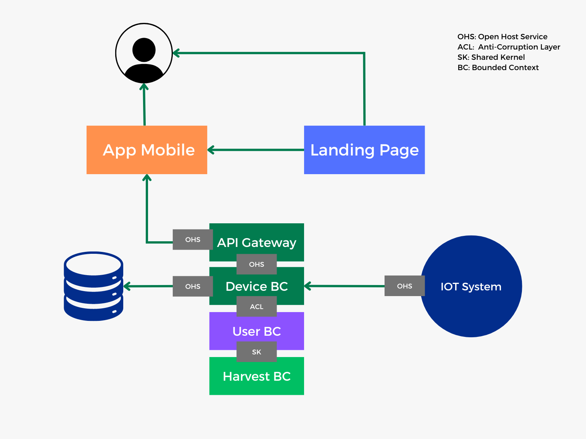
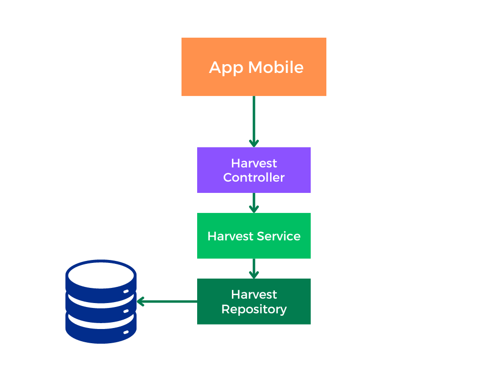
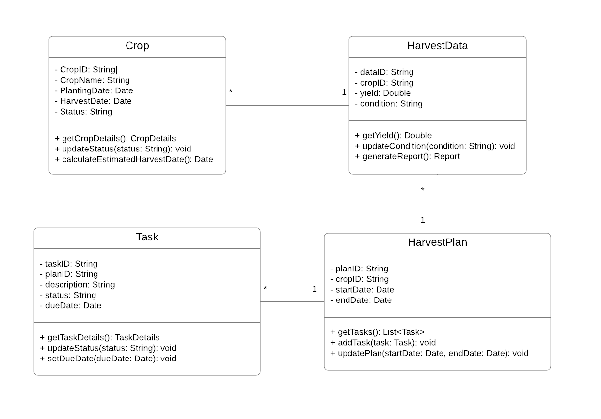
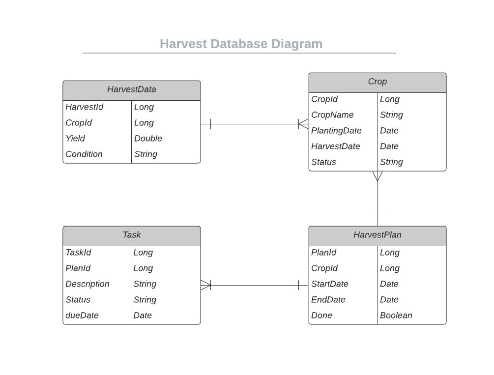

# Capítulo IV: Solution Software Design

## 4.1 Strategic-Level Domain-Driven Design

### 4.1.1 Event Storming

#### 4.1.1.1 Candidate Context Discovery

#### 4.1.1.2 Domain Message Flows Modeling

#### 4.1.1.3 Bounded Contexts Canvases

De igual manera que los apartados anteriores diseñamos los canvas de los principales bounded contexts definidos: 

### 4.1.2 Context Mapping

### 4.1.3 Software Architecture

#### 4.1.3.1 Software Architecture System Landscape Diagram 

#### 4.1.3.2 Software Architecture Context Level Diagrams 

En nuestro diagrama de contexto se presentan las relaciones fundamentales de IAgroT. Esta aplicación web y móvil está conectada principalmente con usuarios distintos y dos sistemas externos, el Payment System para llevar a cabo transacciones de pago y el Notification System para enviar alertas y notificaciones. 

#### 4.1.3.3 Software Architecture Container Level Diagrams 

Con este diagrama se puede observar nuestro proyecto de manera más expandida. Se muestra la aplicación web, landing page, aplicación móvil cada una realizando llamadas API a los distintos Bounded Context que interactuan con los sistemas externos de Payment. Además, a su vez interactuarán con un broker que irá conectado a la Base de Datos.

#### 4.1.3.3. Software Architecture Deployment Diagrams

En nuestro Diagrama de Despliegue nos ayudará a comprender y comunicar la arquitectura física de nuestro sistema de software IAgroT, en el cual usaremos Azure, ya que Azure es una App Service que gestionará automáticamente el enrutamiento a las instancias de función de la configuración de la aplicación. 

## 4.2. Tactical-Level Domain-Driven Design

### 4.2.1. Bounded Context: Harvest

#### 4.2.1.1. Domain Layer

**Nombre:** Harvest

**Descripción:**  
Gestiona la información sobre los cultivos, las cosechas y la planificación relacionada. Incluye la administración de datos agrícolas y la planificación de las actividades de cosecha.

**Entidades:**

#### **Crop**
**Descripción:** Representa un cultivo específico dentro del contexto de cosechas.

- **Atributos:**
  - `cropID` (String)
  - `cropName` (String)
  - `plantingDate` (Date)
  - `harvestDate` (Date)
  - `status` (String)
  
- **Métodos:**
  - `getCropDetails()`
  - `updateStatus()`
  - `calculateEstimatedHarvestDate()`

#### **HarvestData**
**Descripción:** Representa los datos relacionados con la cosecha.

- **Atributos:**
  - `dataID` (String)
  - `cropID` (String)
  - `yield` (Double)
  - `condition` (String)
  
- **Métodos:**
  - `getYield()`
  - `updateCondition()`
  - `generateReport()`

#### **HarvestPlan**
**Descripción:** Representa la planificación de actividades agrícolas.

- **Atributos:**
  - `planID` (String)
  - `cropID` (String)
  - `tasks` (List<String>)
  - `startDate` (Date)
  - `endDate` (Date)
  
- **Métodos:**
  - `getTasks()`
  - `addTask()`
  - `updatePlan()`

### 4.2.1.2. Interface Layer

**Entidades:**

- `Crop`
- `HarvestData`
- `HarvestPlan`

**Objetos de Valor:**

- `CropID`
- `HarvestCondition`

**Enumeraciones:**

- `CropStatus`

**Factories:**

- `CropFactory`
- `HarvestDataFactory`
- `HarvestPlanFactory`

**Interfaces:**

- `ICropRepository`: Interfaz para la gestión de datos de cultivos.
- `IHarvestDataRepository`: Interfaz para la gestión de datos de cosecha.
- `IHarvestPlanRepository`: Interfaz para la gestión de planificación de cosechas.

### 4.2.1.3. Application Layer

**Controllers:**

- `CropController`: Define las funciones para gestionar cultivos, como creación, actualización y eliminación.

**Command Handlers:**

- `CreateCropCommandHandler`: Maneja el comando de creación de un nuevo cultivo.
- `UpdateCropCommandHandler`: Maneja el comando de actualización de un cultivo.

**Event Handlers:**

- `CropCreatedEventHandler`: Maneja el evento de creación de un nuevo cultivo.
- `CropUpdatedEventHandler`: Maneja el evento de actualización de un cultivo.

### 4.2.1.4. Infrastructure Layer

**Servicios:**

- `CropServiceProvider`: Proveedor de servicios externos para gestionar datos de cultivos.

**Repositorios:**

- `CropRepository`: Implementación del repositorio para interactuar con la base de datos de cultivos.
- `HarvestDataRepository`: Implementación del repositorio para los datos de cosecha.
- `HarvestPlanRepository`: Implementación del repositorio para la planificación de cosechas.

### 4.2.1.6. Bounded Context Software Architecture Component Level Diagrams

### 4.2.1.7. Bounded Context Software Architecture Code Level Diagrams

**4.2.1.7.1. Bounded Context Domain Layer Class Diagrams**

**4.2.1.7.2. Bounded Context Database Design Diagram**

### 4.2.2. Bounded Context: Resource

Nombre: Resource

Descripción: Este bounded context está diseñado para gestionar eficientemente los recursos agrícolas, como agua, fertilizantes y pesticidas, y su distribución a los cultivos. A través de aplicaciones móviles y web, los usuarios (agricultores) pueden monitorizar y asignar recursos en tiempo real. El sistema integra componentes para el procesamiento de solicitudes, almacenamiento de datos y publicación de eventos, facilitando el control y optimización de los recursos.

#### 4.2.2.1. Domain Layer

### ResourceEntity:
- **Propósito:** Representa un recurso agrícola que puede ser agua, fertilizantes, pesticidas, etc.
- **Atributos:**
  - `ID (int)`: Identificador único del recurso.
  - `nombreRecurso (string)`: Nombre del recurso (ej., agua, fertilizante).
  - `cantidadDisponible (float)`: Cantidad actual del recurso disponible.
  - `unidadMedida (string)`: Unidad de medida del recurso (litros, kilogramos, etc.).
  - `resourceTypeID (int)`: Identificador del tipo de recurso (agua, fertilizantes, etc.).

### ResourceTypeEntity:
- **Propósito:** Representa los tipos de recursos disponibles en el sistema (agua, fertilizantes, pesticidas).
- **Atributos:**
  - `ID (int)`: Identificador único del tipo de recurso.
  - `tipo (string)`: Tipo de recurso (agua, fertilizante).
  - `descripción (string)`: Descripción del tipo de recurso.

### DistributionEntity:
- **Propósito:** Representa la distribución de un recurso a un cultivo específico.
- **Atributos:**
  - `ID (int)`: Identificador único de la distribución.
  - `cantidadAsignada (float)`: Cantidad de recurso asignado.
  - `fechaDistribucion (DateTime)`: Fecha en la que se realizó la distribución.
  - `cultivoID (int)`: Identificador del cultivo.
  - `resourceID (int)`: Identificador del recurso distribuido.
  - `userID (int)`: Identificador del usuario que gestiona la distribución.

### CultivoEntity:
- **Propósito:** Representa los cultivos gestionados por los agricultores.
- **Atributos:**
  - `ID (int)`: Identificador único del cultivo.
  - `nombreCultivo (string)`: Nombre del cultivo.
  - `tipoCultivo (string)`: Tipo de cultivo (maíz, trigo, etc.).
  - `estado (string)`: Estado del cultivo (crecimiento, madurez, etc.).
  - `userID (int)`: Identificador del agricultor que gestiona el cultivo.

### UserEntity:
- **Propósito:** Representa a los usuarios (agricultores) que gestionan los recursos y cultivos.
- **Atributos:**
  - `ID (int)`: Identificador único del usuario.
  - `nombreUsuario (string)`: Nombre del usuario.
  - `email (string)`: Correo electrónico del usuario.
  - `contraseña (string)`: Contraseña para autenticarse en el sistema.

### ResourceRepository:
- **Propósito:** Gestiona la persistencia y recuperación de los recursos y distribuciones.
- **Métodos:**
  - `saveResource()`: Guarda o actualiza un recurso.
  - `getResourceByID()`: Recupera un recurso por su ID.
  - `saveDistribution()`: Registra una nueva distribución de recurso.
  - `getDistributionsByCultivo()`: Obtiene todas las distribuciones para un cultivo específico.

#### 4.2.2.2. Interface Layer

### ResourceController:
- **Propósito:** Controla las interacciones de los usuarios relacionadas con la gestión de recursos.
- **Métodos:**
  - `viewResources()`: Permite a los usuarios ver el estado actual de los recursos disponibles.
  - `addResource()`: Permite registrar un nuevo recurso agrícola.
  - `viewDistribution()`: Permite ver las distribuciones realizadas en un cultivo específico.

### DistributionController:
- **Propósito:** Controla las interacciones relacionadas con la asignación y distribución de recursos.
- **Métodos:**
  - `assignResource()`: Asigna un recurso a un cultivo.
  - `viewAssignedResources()`: Muestra los recursos asignados a los cultivos.
  - `generateDistributionReport()`: Genera un informe de las distribuciones realizadas.

#### 4.2.2.3. Application Layer

### ResourceCommandHandler:
- **Propósito:** Maneja los comandos relacionados con los recursos, como agregar o modificar recursos.

### DistributionCommandHandler:
- **Propósito:** Maneja los comandos relacionados con la asignación y distribución de recursos a los cultivos.

### ResourceEventHandler:
- **Propósito:** Maneja eventos relacionados con la actualización y el monitoreo de los recursos.

### DistributionEventHandler:
- **Propósito:** Maneja eventos relacionados con las distribuciones de recursos.

#### 4.2.2.4. Infrastructure Layer

### ResourceRepositoryImpl:
- **Propósito:** Implementa la interfaz del repositorio de recursos para gestionar la persistencia de los datos en la base de datos.

### DistributionRepositoryImpl:
- **Propósito:** Implementa la interfaz del repositorio de distribuciones para gestionar la persistencia de las asignaciones de recursos.

### ResourceEventPublisher:
- **Propósito:** Publica eventos relacionados con la gestión de los recursos para que otros sistemas puedan suscribirse a ellos.

### DistributionEventPublisher:
- **Propósito:** Publica eventos relacionados con las distribuciones para facilitar la trazabilidad y el monitoreo.

#### 4.2.2.5. Bounded Context Software Architecture Component Level Diagrams

#### 4.2.2.6. Bounded Context Software Architecture Code Level Diagrams

##### 4.2.2.6.1. Bounded Context Domain Layer Class Diagrams

##### 4.2.2.6.2. Bounded Context Database Design Diagram

