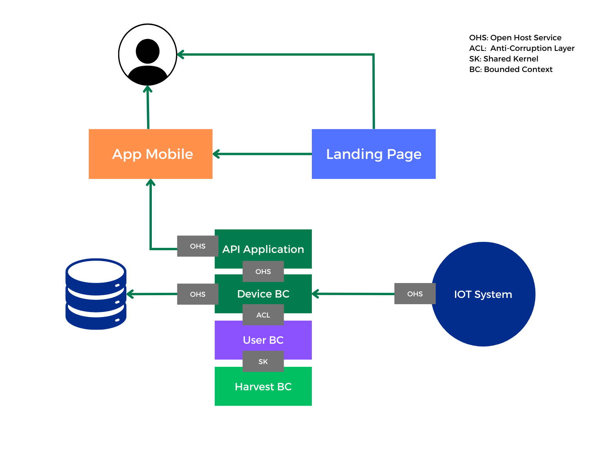

# Capítulo IV: Solution Software Design

## 4.1 Strategic-Level Domain-Driven Design

### 4.1.1 Event Storming

#### 4.1.1.1 Candidate Context Discovery

#### 4.1.1.2 Domain Message Flows Modeling

#### 4.1.1.3 Bounded Contexts Canvases

De igual manera que los apartados anteriores diseñamos los canvas de los principales bounded contexts definidos: 

### 4.1.2 Context Mapping

### 4.1.3 Software Architecture

#### 4.1.3.1 Software Architecture System Landscape Diagram 

#### 4.1.3.2 Software Architecture Context Level Diagrams 

En nuestro diagrama de contexto se presentan las relaciones fundamentales de IAgroT. Esta aplicación web y móvil está conectada principalmente con usuarios distintos y dos sistemas externos, el Payment System para llevar a cabo transacciones de pago y el Notification System para enviar alertas y notificaciones. 

#### 4.1.3.3 Software Architecture Container Level Diagrams 

Con este diagrama se puede observar nuestro proyecto de manera más expandida. Se muestra la aplicación web, landing page, aplicación móvil cada una realizando llamadas API a los distintos Bounded Context que interactuan con los sistemas externos de Payment. Además, a su vez interactuarán con un broker que irá conectado a la Base de Datos.

#### 4.1.3.3. Software Architecture Deployment Diagrams

## 4.2. Tactical-Level Domain-Driven Design

### 4.2.1. Bounded Context: Harvest

#### 4.2.1.1. Domain Layer

**Nombre:** Harvest

**Descripción:**  
Gestiona la información sobre los cultivos, las cosechas y la planificación relacionada. Incluye la administración de datos agrícolas y la planificación de las actividades de cosecha.

**Entidades:**

#### **Crop**
**Descripción:** Representa un cultivo específico dentro del contexto de cosechas.

- **Atributos:**
  - `cropID` (String)
  - `cropName` (String)
  - `plantingDate` (Date)
  - `harvestDate` (Date)
  - `status` (String)
  
- **Métodos:**
  - `getCropDetails()`
  - `updateStatus()`
  - `calculateEstimatedHarvestDate()`

#### **HarvestData**
**Descripción:** Representa los datos relacionados con la cosecha.

- **Atributos:**
  - `dataID` (String)
  - `cropID` (String)
  - `yield` (Double)
  - `condition` (String)
  
- **Métodos:**
  - `getYield()`
  - `updateCondition()`
  - `generateReport()`

#### **HarvestPlan**
**Descripción:** Representa la planificación de actividades agrícolas.

- **Atributos:**
  - `planID` (String)
  - `cropID` (String)
  - `tasks` (List<String>)
  - `startDate` (Date)
  - `endDate` (Date)
  
- **Métodos:**
  - `getTasks()`
  - `addTask()`
  - `updatePlan()`

### 4.2.1.2. Interface Layer

**Entidades:**

- `Crop`
- `HarvestData`
- `HarvestPlan`

**Objetos de Valor:**

- `CropID`
- `HarvestCondition`

**Enumeraciones:**

- `CropStatus`

**Factories:**

- `CropFactory`
- `HarvestDataFactory`
- `HarvestPlanFactory`

**Interfaces:**

- `ICropRepository`: Interfaz para la gestión de datos de cultivos.
- `IHarvestDataRepository`: Interfaz para la gestión de datos de cosecha.
- `IHarvestPlanRepository`: Interfaz para la gestión de planificación de cosechas.

### 4.2.1.3. Application Layer

**Controllers:**

- `CropController`: Define las funciones para gestionar cultivos, como creación, actualización y eliminación.

**Command Handlers:**

- `CreateCropCommandHandler`: Maneja el comando de creación de un nuevo cultivo.
- `UpdateCropCommandHandler`: Maneja el comando de actualización de un cultivo.

**Event Handlers:**

- `CropCreatedEventHandler`: Maneja el evento de creación de un nuevo cultivo.
- `CropUpdatedEventHandler`: Maneja el evento de actualización de un cultivo.

### 4.2.1.4. Infrastructure Layer

**Servicios:**

- `CropServiceProvider`: Proveedor de servicios externos para gestionar datos de cultivos.

**Repositorios:**

- `CropRepository`: Implementación del repositorio para interactuar con la base de datos de cultivos.
- `HarvestDataRepository`: Implementación del repositorio para los datos de cosecha.
- `HarvestPlanRepository`: Implementación del repositorio para la planificación de cosechas.

### 4.2.1.6. Bounded Context Software Architecture Component Level Diagrams

### 4.2.1.7. Bounded Context Software Architecture Code Level Diagrams

**4.2.1.7.1. Bounded Context Domain Layer Class Diagrams**

**4.2.1.7.2. Bounded Context Database Design Diagram**

