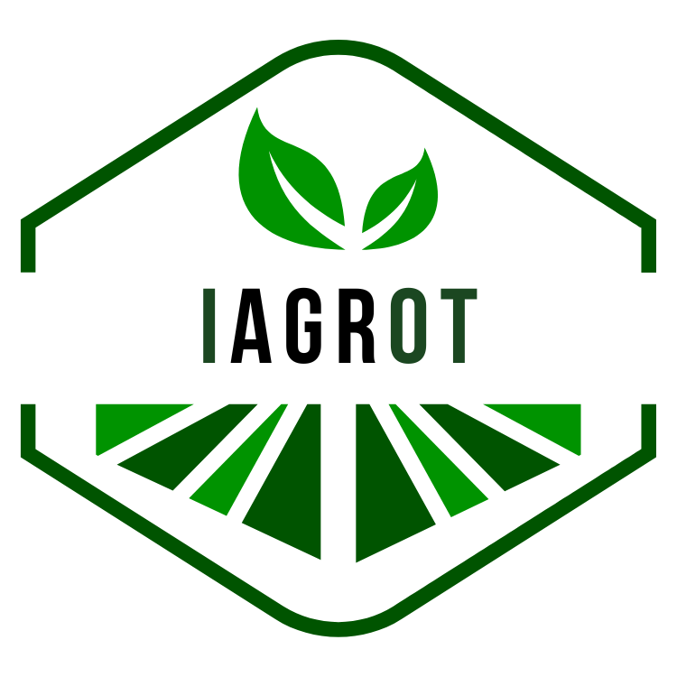

# Capítulo V: Solution UI/UX Design

## 5.1 Style Guidelines

### 5.1.1. General Style Guidelines

### Brand Overview
La creciente necesidad de optimizar la gestión agrícola en un entorno cada vez más afectado por el cambio climático y la variabilidad de los recursos naturales ha puesto de manifiesto la importancia de contar con herramientas tecnológicas avanzadas. **IAgroT** surge como respuesta a esta necesidad, proporcionando una solución integral que combina dispositivos IoT y una plataforma móvil para el monitoreo y gestión de cultivos en tiempo real. Nuestro equipo ha desarrollado esta solución para ofrecer a los agricultores peruanos una herramienta eficiente, accesible y personalizada que les permita maximizar la productividad de sus tierras y garantizar la sostenibilidad a largo plazo de sus cultivos.

### Brand Name
El nombre del software identificado es **IAgroT**. Este nombre surgió a partir de la necesidad de integrar tecnología avanzada en la agricultura, enfocándonos en soluciones que optimicen la gestión de cultivos a través de dispositivos IoT. El equipo eligió una combinación de "I" por Internet y "Agro", que representa el sector agrícola, para resaltar la conexión directa entre tecnología e innovación en el campo. La letra "T" representa la transformación digital en la agricultura. Esperamos que los agricultores y técnicos asocien IAgroT con herramientas tecnológicas que modernizan y optimizan sus procesos agrícolas, facilitando el monitoreo y gestión eficiente de sus cultivos.

  

### Typography
La tipografía es un elemento esencial para estructurar y organizar el lenguaje visual de todas las plataformas desarrolladas para IAgroT. Es fundamental que las fuentes seleccionadas sean legibles y contribuyan a mejorar la experiencia del usuario en la interfaz. Por ello, se ha elegido la fuente **Nunito** como la principal, una tipografía sans-serif moderna y amigable que se adapta bien al enfoque tecnológico del proyecto. Nunito destaca por su legibilidad tanto en pantallas pequeñas como grandes, aportando claridad y consistencia en todos los dispositivos utilizados por los agricultores y técnicos.

Como tipografía secundaria, se ha optado por **Roboto Flex**, una fuente versátil y flexible que complementa a Nunito. Roboto Flex será utilizada en textos secundarios y áreas que requieran una mayor variabilidad en peso y estilo, aportando dinamismo sin perder la coherencia visual en la experiencia del usuario.

### Head

### Body

### Colors

### Spacing

#### Tono de comunicación y lenguaje aplicado
- **Color Primario:** El color primario (#049404) refleja la esencia de la naturaleza y la vida agrícola. Este verde vibrante representa el crecimiento, la frescura y la sustentabilidad, valores centrales de IAgroT. Se ha elegido para transmitir una sensación de confianza y seguridad a los agricultores, ya que está vinculado con la idea de campos fértiles y una agricultura próspera.
- **Color Secundario:** El color secundario (#A2CA71) aporta un tono suave y relajante asociado con el bienestar y el equilibrio natural. Este verde más claro evoca esperanza y renovación, conectando al usuario con el ciclo natural de la vida agrícola.
- **Blanco:** El blanco (#FFFFFF) se utiliza para transmitir claridad y simplicidad en la interfaz. Este color permite que los elementos importantes resalten, brindando un aspecto limpio y moderno que facilita la navegación y la lectura.
- **Negro:** Los tonos de negro (#000000, #1D1D1D, #282828) son utilizados para dar un toque de elegancia y profesionalismo a la plataforma. Estos colores refuerzan la seriedad de los datos presentados, asegurando que la tecnología de IAgroT se perciba como confiable y precisa.
- **Grises:** Los tonos de gris (#333333, #4F4F4F, #828282, #BDBDBD, #E0E0E0) aportan neutralidad y equilibrio al diseño, sirviendo de fondo para resaltar la información esencial.

  El lenguaje utilizado en la plataforma será accesible, profesional y orientado al soporte, ya que IAgroT busca no solo ofrecer soluciones tecnológicas, sino también acompañar al agricultor en su camino hacia la optimización de sus cultivos. La comunicación debe ser clara, confiable y cercana, promoviendo la eficiencia y el uso adecuado de la tecnología para transformar la agricultura.

### 5.1.2. Web, Mobile and IoT Style Guidelines

Desarrollaremos una aplicación adaptable a cualquier dispositivo tecnológico sin comprometer el diseño del contenido. Por esta razón, se considerará cada tipo de dispositivo, garantizando que el contenido esté organizado de la forma más adecuada para cada uno.

Emplearemos el patrón **Z** en nuestro diseño, comenzando con la identificación de nuestra marca que se ubicará en la esquina superior izquierda. Desde ahí, el usuario iniciará su interacción visual con el logotipo de IAgroT. Luego se desplazará horizontalmente hacia la derecha, donde encontrará las opciones principales como "Inicio", "Nosotros", "Servicios" y "Contáctanos", facilitando su navegación por el sitio. A continuación, el usuario bajará verticalmente para interactuar con el contenido principal, donde verá el mensaje destacado sobre la agricultura inteligente junto con una imagen representativa. Finalmente, el recorrido terminará en la parte inferior, donde podrá acceder a los enlaces de descarga de la aplicación en Google Play y App Gallery, asegurando un acceso fácil a las plataformas móviles.

Este flujo visual asegura que el usuario capte de manera eficiente los elementos clave del sitio, manteniendo una estructura intuitiva y fluida.

## 5.2. Information Architecture

### 5.2.1. Organization Systems

En esta sección, describiremos cómo se implementarán diferentes métodos de organización visual para cada uno de nuestros segmentos de usuarios en la plataforma IAgroT, asegurando que el contenido esté estructurado de manera coherente y accesible.

### Segmento 1: Agricultores Pequeños y Medianos
**Jerárquica:**
- **Cultivos y Recursos:** 
  Los agricultores podrán acceder a una lista de sus cultivos y recursos. Esta información se organizará por categorías de cultivo (como frutas, vegetales, etc.) y por recursos (agua, fertilizantes), permitiendo a los usuarios navegar y monitorear el estado de cada elemento.
- **Recomendaciones de Gestión:**
  Se mostrarán recomendaciones personalizadas basadas en los datos recopilados en tiempo real. Estas recomendaciones estarán organizadas por prioridad (alta, media, baja) y secciones específicas de acción, como riego o fertilización.
- **Alertas de Condiciones Climáticas:**
  Las alertas se organizarán cronológicamente, mostrando primero las alertas más recientes o críticas que afecten a los cultivos.

**Secuencial:**
- **Configuración del Sistema de Monitoreo:**
  Los agricultores seguirán un conjunto de pasos para configurar el sistema de monitoreo. Esto incluirá la selección de sensores, la definición de umbrales de alerta, y la configuración de notificaciones.

### Segmento 2: Técnicos Agrícolas y Asesores
**Jerárquica:**
- **Lista de Agricultores:**
  Los técnicos podrán ver una lista de agricultores que están utilizando la plataforma, organizada por región o tipo de cultivo.
- **Análisis de Datos Agrícolas:**
  Los técnicos accederán a un panel de control donde los datos de los cultivos se organizan en gráficos y tablas por categorías como tipo de cultivo, salud del suelo, y uso de recursos.
- **Informes de Rendimiento:**
  Los informes generados se organizarán por fecha y tipo, facilitando la revisión de la evolución del rendimiento de los cultivos a lo largo del tiempo.

### Características Compartidas

**Jerárquica:**
- **Landing Page:**
  Información general sobre el uso de la plataforma IAgroT, con detalles sobre funcionalidades y ventajas, organizada de manera que los elementos más importantes aparezcan primero.
- **Reseñas:**
  Evaluaciones de usuarios sobre la efectividad de las herramientas y dispositivos utilizados, organizadas de manera cronológica.

**Matricial:**
- **Menú de Opciones:**
  Tanto agricultores como técnicos tendrán acceso a un menú principal con categorías específicas como "Monitoreo de Cultivos", "Alertas", "Configuraciones", y "Análisis de Datos".
- **Noticias y Recomendaciones:**
  Actualizaciones y sugerencias organizadas por temas relacionados con agricultura sostenible, nuevos productos y cambios climáticos.

### 5.2.2 Labeling Systems

Presentamos el sistema de etiquetado que permitirá a los usuarios de IAgroT acceder a la información relevante de manera rápida y eficiente.

- **Dashboard Principal:** "Home" – Información clave sobre el estado general de los cultivos y recursos, con gráficos de fácil interpretación.
- **Gestión de Cultivos:** "Manage Crops" – Sección donde los agricultores pueden añadir, editar o eliminar información sobre sus cultivos.
- **Monitoreo en Tiempo Real:** "Real-Time Monitoring" – Espacio donde se muestran datos en vivo del estado del cultivo y las condiciones ambientales.
- **Alertas y Notificaciones:** "Alerts" – Sección dedicada a mostrar todas las alertas activas relacionadas con el estado del cultivo y condiciones climáticas.
- **Configuraciones:** "Settings" – Sección donde los usuarios pueden ajustar preferencias de monitoreo, notificaciones, y gestionar perfiles.

### 5.2.3 SEO Tags and Meta Tags Systems

A continuación, se presentan las etiquetas SEO y Meta Tags empleadas en las páginas principales de la plataforma IAgroT para mejorar su visibilidad en motores de búsqueda.

- **Meta Title:** "IAgroT - Plataforma de Monitoreo Agrícola Inteligente"
- **Meta Description:** "Optimiza la gestión agrícola con IAgroT. Monitoreo en tiempo real, alertas climáticas y recomendaciones basadas en datos para maximizar la productividad."
- **Keywords:** "Agricultura Inteligente, IoT en Agricultura, Monitoreo de Cultivos, Gestión de Recursos, Alertas Climáticas"
- **Alt Text para Imágenes:** "Gráfico de monitoreo de cultivos en tiempo real", "Dispositivo IoT para agricultura sostenible".

### 5.2.4 Searching Systems

En esta sección se detallan los sistemas de búsqueda diseñados para facilitar la localización de información en la plataforma IAgroT.

### Segmento 1: Agricultores
- **Búsqueda de Cultivos:**
  Los agricultores podrán buscar información específica de sus cultivos utilizando filtros como tipo de cultivo, estado del crecimiento, y fecha de plantación. Los resultados se mostrarán en formato de lista con detalles resumidos, y un clic en un cultivo específico abrirá una vista detallada.
- **Búsqueda de Recomendaciones:**
  Los usuarios pueden aplicar filtros para buscar recomendaciones específicas basadas en la condición del cultivo, tipo de recurso (agua, fertilizante) o fecha.

### Segmento 2: Técnicos y Asesores
- **Búsqueda de Agricultores:**
  Los técnicos podrán buscar a agricultores específicos usando una barra de búsqueda o filtros avanzados como ubicación, tipo de cultivo, y nivel de interacción.
- **Análisis de Datos:**
  Los técnicos podrán buscar y filtrar datos históricos o específicos de cultivos para realizar análisis detallados.

### 5.2.5 Navigation Systems

Los sistemas de navegación han sido diseñados para guiar a los usuarios de manera intuitiva a través de las distintas funciones de la plataforma IAgroT.

- **Barra de Navegación Global:** 
  En la parte superior de todas las páginas, se encuentra una barra de navegación horizontal con enlaces a "Home", "Gestión de Cultivos", "Alertas", "Monitoreo en Tiempo Real", y "Configuraciones".
- **Menú Lateral para Aplicaciones Móviles:**
  En las versiones móviles, se utiliza un menú lateral desplegable donde los usuarios pueden acceder rápidamente a las secciones principales.

Estos sistemas garantizan una experiencia de usuario optimizada, facilitando la navegación y el acceso a la información relevante para cada segmento de usuarios en la plataforma IAgroT.
