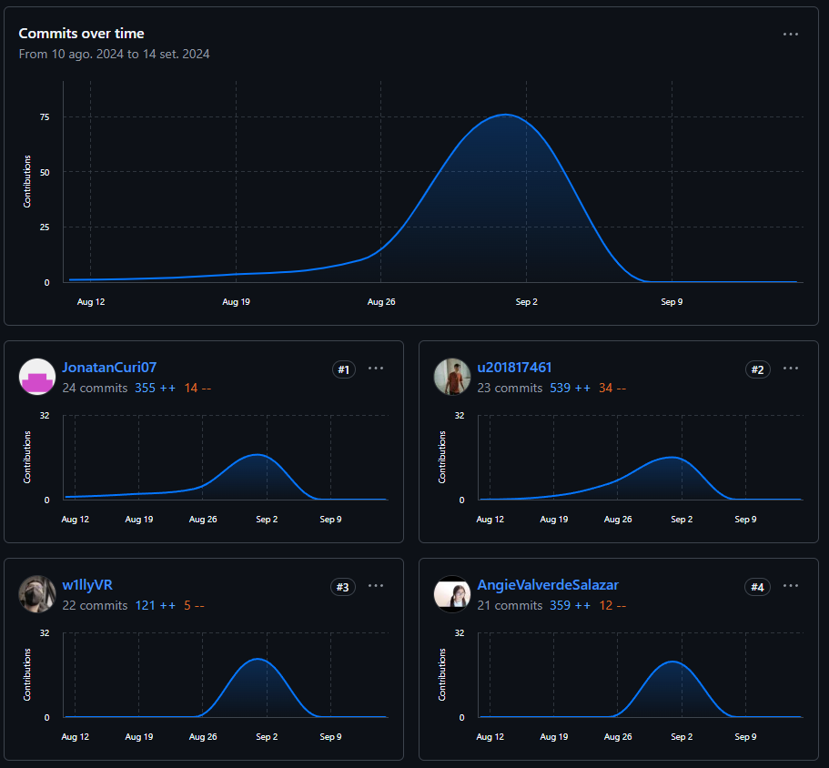

<h3 align="center">Universidad Peruana de Ciencias Aplicadas</h3> 

  

<h4 align="center">Ingeniería de Sistemas y Computación | Ingeniería de Software</h4>
<h4 align="center">Desarrollo de Soluciones IOT</h4>
<h4 align="center">Informe de Trabajo Parcial</h4>

  <strong>Startup: Los Harcoderos</strong>
   Integrantes:
   Benedetti Rivas Lucas Sebastian - U201817461
   Curi Montero, Jonatan Omar - U201912404
   Valentin Ricaldi Willy David - U20201c037
   Valverde Salazar Clara Angie - U20201b940
   
  <strong>Sección:</strong> SW74
   <strong>Profesor:</strong> Angel Augusto Velasquez Nuñez 
   <strong>Producto:</strong> IAgrOT                         
   <strong>Ciclo:</strong> 2024-02
  <h4 align="center">Septiembre, 2024</h4>  

<h2 align="center">Registro de Versiones del Informe</h2>

<table align="center">
  <tr>
    <th>Versión</th>
    <th>Fecha</th>
    <th>Autor</th>
    <th>Descripción</th>
  </tr>
  <tr>
    <td align="center">V0.1</td>
    <td align="center">23/08/2024</td>
    <td align="center">Jonatan Curi Montero</td>
    <td align="center">Apertura, Base de Proyecto</td>
  </tr>
  <tr>
    <td align="center">V0.2</td>
    <td align="center">26/08/2024</td>
    <td align="center">Lucas Benedetti Rivas</td>
    <td align="center">Finalización de Capítulo I • Startup Profile • Solution Profile • Segmentos Objetivos</td>
  </tr>
  <tr>
    <td align="center">V0.3</td>
    <td align="center">02/09/2024</td>
    <td align="center">Jonatan Curi Montero</td>
    <td align="center">Finalización de Capítulo II • Competidores • Entrevistas • Needfinding • Ubiquitous Language</td>
  </tr>
  <tr>
    <td align="center">V0.5</td>
    <td align="center">04/09/2024</td>
    <td align="center">Jonatan Curi Montero</td>
    <td align="center">Finalización de Capítulo III</td>
  </tr>
  <tr>
    <td align="center">V0.6</td>
    <td align="center">06/09/2024</td>
    <td align="center">Lucas Benedetti Rivas</td>
    <td align="center">Finalización de Capítulo IV</td>
  </tr>
  <tr>
    <td align="center">V0.7</td>
    <td align="center">16/09/2024</td>
    <td align="center">Lucas Benedetti Rivas</td>
    <td align="center">Finalización de Capítulo V</td>
  </tr>
</table>

# Project Report Collaboration Insights

Reporte del Proyecto en GitHub: https://github.com/Grupo01-Soluciones-IoT/Report-Project.git 
## Collaboration Insights - TB1:
En este entregable, se desarrollo la documentacion de 4 capitulos, Introducción, Requirements Elicitation & Analysis, Requirements Specification y Solution Software Design, a su vez para tener un seguimiento de las tareas para elaborar por cada colaborador se utilizo Notion: 

  

### Contributors:
Se puede visualizar la cantidad de commits por cada colaborador, así como agregaciones y eliminaciones, así como la curva de colaboración, teniendo como pico fin de mes de Agosto.

  

### Commits:
Se visualiza la cantidad de Commits que se realizaron dia a dia, se aprovecho el dia 25 de Agosto, siendo fines de semana para desarrollar de manera continua.

  

## Collaboration Insights - TP:
En este entregable, se desarrollo la documentacion de 4 capitulos, Solution UI/UX Design y Product Implementation, Validation & Deployment, a su vez para tener un seguimiento de las tareas para elaborar por cada colaborador se utilizo Notion: 

  

### Contributors:
Se puede visualizar la cantidad de commits por cada colaborador, así como agregaciones y eliminaciones, así como la curva de colaboración, teniendo como pico fin de mes de Agosto.

 

### Frontend App Web

 

### Commits:
Se visualiza la cantidad de Commits que se realizaron dia a dia, se aprovecho el dia 25 de Agosto, siendo fines de semana para desarrollar de manera continua.

 

### Frontend App Web

 

# Índice del Proyecto

## Capítulo I: Introducción
1.1. [Startup Profile](./Capitulo%20I%20-%20Introduction.md#11-startup-profile)  
&nbsp;&nbsp;1.1.1. [Descripción de la Startup](./Capitulo%20I%20-%20Introduction.md#111-descripción-de-la-startup)  
&nbsp;&nbsp;1.1.2. [Perfiles de integrantes del equipo](./Capitulo%20I%20-%20Introduction.md#112-perfiles-de-integrantes-del-equipo)  
1.2. [Solution Profile](./Capitulo%20I%20-%20Introduction.md#12-solution-profile)  
&nbsp;&nbsp;1.2.1. [Antecedentes y problemática](./Capitulo%20I%20-%20Introduction.md#121-antecedentes-y-problemática)  
&nbsp;&nbsp;1.2.2. [Lean UX Process](./Capitulo%20I%20-%20Introduction.md#122-lean-ux-process)  
&nbsp;&nbsp;&nbsp;&nbsp;1.2.2.1. [Lean UX Problem Statements](./Capitulo%20I%20-%20Introduction.md#1221-lean-ux-problem-statements)  
&nbsp;&nbsp;&nbsp;&nbsp;1.2.2.2. [Lean UX Assumptions](./Capitulo%20I%20-%20Introduction.md#1222-lean-ux-assumptions)  
&nbsp;&nbsp;&nbsp;&nbsp;1.2.2.3. [Lean UX Hypothesis Statements](./Capitulo%20I%20-%20Introduction.md#1223-lean-ux-hypothesis-statements)  
&nbsp;&nbsp;&nbsp;&nbsp;1.2.2.4. [Lean UX Canvas](./Capitulo%20I%20-%20Introduction.md#1224-lean-ux-canvas)  
1.3. [Segmentos objetivo](./Capitulo%20I%20-%20Introduction.md#13-segmentos-objetivo)  

## Capítulo II: Requirements Elicitation & Analysis
2.1. [Competidores](./Capitulo%20II%20-%20Requirements%20Elicitation%20&%20Analysis.md#21-competidores)  
&nbsp;&nbsp;2.1.1. [Análisis competitivo](./Capitulo%20II%20-%20Requirements%20Elicitation%20&%20Analysis.md#211-análisis-competitivo)  
&nbsp;&nbsp;2.1.2. [Estrategias y tácticas frente a competidores](./Capitulo%20II%20-%20Requirements%20Elicitation%20&%20Analysis.md#212-estrategias-y-tácticas-frente-a-competidores)  
2.2. [Entrevistas](./Capitulo%20II%20-%20Requirements%20Elicitation%20&%20Analysis.md#22-entrevistas)  
&nbsp;&nbsp;2.2.1. [Diseño de entrevistas](./Capitulo%20II%20-%20Requirements%20Elicitation%20&%20Analysis.md#221-diseño-de-entrevistas)  
&nbsp;&nbsp;2.2.2. [Registro de entrevistas](./Capitulo%20II%20-%20Requirements%20Elicitation%20&%20Analysis.md#222-registro-de-entrevistas)  
&nbsp;&nbsp;2.2.3. [Análisis de entrevistas](./Capitulo%20II%20-%20Requirements%20Elicitation%20&%20Analysis.md#223-análisis-de-entrevistas)  
2.3. [Needfinding](./Capitulo%20II%20-%20Requirements%20Elicitation%20&%20Analysis.md#23-needfinding)  
&nbsp;&nbsp;2.3.1. [User Personas](./Capitulo%20II%20-%20Requirements%20Elicitation%20&%20Analysis.md#231-user-personas)  
&nbsp;&nbsp;2.3.2. [User Task Matrix](./Capitulo%20II%20-%20Requirements%20Elicitation%20&%20Analysis.md#232-user-task-matrix)  
&nbsp;&nbsp;2.3.3. [User Journey Mapping](./Capitulo%20II%20-%20Requirements%20Elicitation%20&%20Analysis.md#233-user-journey-mapping)  
&nbsp;&nbsp;2.3.4. [Empathy Mapping](./Capitulo%20II%20-%20Requirements%20Elicitation%20&%20Analysis.md#234-empathy-mapping)  
&nbsp;&nbsp;2.3.5. [As-is Scenario Mapping](./Capitulo%20II%20-%20Requirements%20Elicitation%20&%20Analysis.md#235-as-is-scenario-mapping)  
2.4. [Ubiquitous Language](./Capitulo%20II%20-%20Requirements%20Elicitation%20&%20Analysis.md#24-ubiquitous-language)  

## Capítulo III: Requirements Specification
3.1. [To-Be Scenario Mapping](./Capitulo%20III%20-%20Requirements%20Specification.md#31-to-be-scenario-mapping)  
3.2. [User Stories](./Capitulo%20III%20-%20Requirements%20Specification.md#32-user-stories)  
3.3. [Impact Mapping](./Capitulo%20III%20-%20Requirements%20Specification.md#33-impact-mapping)  
3.4. [Product Backlog](./Capitulo%20III%20-%20Requirements%20Specification.md#34-product-backlog)  

## Capítulo IV: Solution Software Design
4.1. [Strategic-Level Domain-Driven Design](./Capitulo%20IV%20-%20Solution%20Software%20Design.md#41-strategic-level-domain-driven-design)  
&nbsp;&nbsp;4.1.1. [EventStorming](./Capitulo%20IV%20-%20Solution%20Software%20Design.md#411-eventstorming)  
&nbsp;&nbsp;&nbsp;&nbsp;4.1.1.1. [Candidate Context Discovery](./Capitulo%20IV%20-%20Solution%20Software%20Design.md#4111-candidate-context-discovery)  
&nbsp;&nbsp;&nbsp;&nbsp;4.1.1.2. [Domain Message Flows Modeling](./Capitulo%20IV%20-%20Solution%20Software%20Design.md#4112-domain-message-flows-modeling)  
&nbsp;&nbsp;&nbsp;&nbsp;4.1.1.3. [Bounded Context Canvases](./Capitulo%20IV%20-%20Solution%20Software%20Design.md#4113-bounded-context-canvases)  
&nbsp;&nbsp;4.1.2. [Context Mapping](./Capitulo%20IV%20-%20Solution%20Software%20Design.md#412-context-mapping)  
&nbsp;&nbsp;4.1.3. [Software Architecture](./Capitulo%20IV%20-%20Solution%20Software%20Design.md#413-software-architecture)  
&nbsp;&nbsp;&nbsp;&nbsp;4.1.3.1. [Software Architecture System Landscape Diagram](./Capitulo%20IV%20-%20Solution%20Software%20Design.md#4131-software-architecture-system-landscape-diagram)  
&nbsp;&nbsp;&nbsp;&nbsp;4.1.3.2. [Software Architecture Context Level Diagrams](./Capitulo%20IV%20-%20Solution%20Software%20Design.md#4132-software-architecture-context-level-diagrams)  
&nbsp;&nbsp;&nbsp;&nbsp;4.1.3.3. [Software Architecture Container Level Diagrams](./Capitulo%20IV%20-%20Solution%20Software%20Design.md#4133-software-architecture-container-level-diagrams)  
&nbsp;&nbsp;&nbsp;&nbsp;4.1.3.4. [Software Architecture Deployment Diagrams](./Capitulo%20IV%20-%20Solution%20Software%20Design.md#4134-software-architecture-deployment-diagrams)  

4.2. [Tactical-Level Domain-Driven Design](./Capitulo%20IV%20-%20Solution%20Software%20Design.md#42-tactical-level-domain-driven-design)  
&nbsp;&nbsp;4.2.1. [Bounded Context: Harvest](./Capitulo%20IV%20-%20Solution%20Software%20Design.md#421-bounded-context-harvest)  
&nbsp;&nbsp;&nbsp;&nbsp;4.2.1.1. [Domain Layer](./Capitulo%20IV%20-%20Solution%20Software%20Design.md#4211-domain-layer)  
&nbsp;&nbsp;&nbsp;&nbsp;4.2.1.2. [Interface Layer](./Capitulo%20IV%20-%20Solution%20Software%20Design.md#4212-interface-layer)  
&nbsp;&nbsp;&nbsp;&nbsp;4.2.1.3. [Application Layer](./Capitulo%20IV%20-%20Solution%20Software%20Design.md#4213-application-layer)  
&nbsp;&nbsp;&nbsp;&nbsp;4.2.1.4. [Infrastructure Layer](./Capitulo%20IV%20-%20Solution%20Software%20Design.md#4214-infrastructure-layer)  
&nbsp;&nbsp;&nbsp;&nbsp;4.2.1.5. [Bounded Context Software Architecture Component Level Diagrams](./Capitulo%20IV%20-%20Solution%20Software%20Design.md#4215-bounded-context-software-architecture-component-level-diagrams)  
&nbsp;&nbsp;&nbsp;&nbsp;4.2.1.6. [Bounded Context Software Architecture Code Level Diagrams](./Capitulo%20IV%20-%20Solution%20Software%20Design.md#4216-bounded-context-software-architecture-code-level-diagrams)  
&nbsp;&nbsp;&nbsp;&nbsp;&nbsp;&nbsp;4.2.1.6.1. [Bounded Context Domain Layer Class Diagrams](./Capitulo%20IV%20-%20Solution%20Software%20Design.md#42161-bounded-context-domain-layer-class-diagrams)  
&nbsp;&nbsp;&nbsp;&nbsp;&nbsp;&nbsp;4.2.1.6.2. [Bounded Context Database Design Diagram](./Capitulo%20IV%20-%20Solution%20Software%20Design.md#42162-bounded-context-database-design-diagram)  
&nbsp;&nbsp;4.2.2. [Bounded Context: Resource](./Capitulo%20IV%20-%20Solution%20Software%20Design.md#422-bounded-context-resource)  
&nbsp;&nbsp;&nbsp;&nbsp;4.2.2.1. [Domain Layer](./Capitulo%20IV%20-%20Solution%20Software%20Design.md#4221-domain-layer)  
&nbsp;&nbsp;&nbsp;&nbsp;4.2.2.2. [Interface Layer](./Capitulo%20IV%20-%20Solution%20Software%20Design.md#4222-interface-layer)  
&nbsp;&nbsp;&nbsp;&nbsp;4.2.2.3. [Application Layer](./Capitulo%20IV%20-%20Solution%20Software%20Design.md#4223-application-layer)  
&nbsp;&nbsp;&nbsp;&nbsp;4.2.2.4. [Infrastructure Layer](./Capitulo%20IV%20-%20Solution%20Software%20Design.md#4224-infrastructure-layer)  
&nbsp;&nbsp;&nbsp;&nbsp;4.2.2.5. [Bounded Context Software Architecture Component Level Diagrams](./Capitulo%20IV%20-%20Solution%20Software%20Design.md#4225-bounded-context-software-architecture-component-level-diagrams)  
&nbsp;&nbsp;&nbsp;&nbsp;4.2.2.6. [Bounded Context Software Architecture Code Level Diagrams](./Capitulo%20IV%20-%20Solution%20Software%20Design.md#4226-bounded-context-software-architecture-code-level-diagrams)  
&nbsp;&nbsp;&nbsp;&nbsp;&nbsp;&nbsp;4.2.2.6.1. [Bounded Context Domain Layer Class Diagrams](./Capitulo%20IV%20-%20Solution%20Software%20Design.md#42261-bounded-context-domain-layer-class-diagrams)  
&nbsp;&nbsp;&nbsp;&nbsp;&nbsp;&nbsp;4.2.2.6.2. [Bounded Context Database Design Diagram](./Capitulo%20IV%20-%20Solution%20Software%20Design.md#42262-bounded-context-database-design-diagram)

## Capítulo V: Solution UI/UX Design
&nbsp;&nbsp;5.1. [Style Guidelines](Capitulo%20V%20-%20Solution%20UI%20UX%20Design.md#51-style-guidelines)  
&nbsp;&nbsp;&nbsp;&nbsp;5.1.1. [General Style Guidelines](Capitulo%20V%20-%20Solution%20UI%20UX%20Design.md#511-general-style-guidelines)  
&nbsp;&nbsp;&nbsp;&nbsp;5.1.2. [Web, Mobile and IoT Style Guidelines](Capitulo%20V%20-%20Solution%20UI%20UX%20Design.md#512-web-mobile-and-iot-style-guidelines)  
&nbsp;&nbsp;5.2. [Information Architecture](Capitulo%20V%20-%20Solution%20UI%20UX%20Design.md#52-information-architecture)  
&nbsp;&nbsp;&nbsp;&nbsp;5.2.1. [Organization Systems](Capitulo%20V%20-%20Solution%20UI%20UX%20Design.md#521-organization-systems)  
&nbsp;&nbsp;&nbsp;&nbsp;5.2.2. [Labeling Systems](Capitulo%20V%20-%20Solution%20UI%20UX%20Design.md#522-labeling-systems)  
&nbsp;&nbsp;&nbsp;&nbsp;5.2.3. [SEO Tags and Meta Tags](Capitulo%20V%20-%20Solution%20UI%20UX%20Design.md#523-seo-tags-and-meta-tags)  
&nbsp;&nbsp;&nbsp;&nbsp;5.2.4. [Searching Systems](Capitulo%20V%20-%20Solution%20UI%20UX%20Design.md#524-searching-systems)  
&nbsp;&nbsp;&nbsp;&nbsp;5.2.5. [Navigation Systems](Capitulo%20V%20-%20Solution%20UI%20UX%20Design.md#525-navigation-systems)  
&nbsp;&nbsp;5.3. [Landing Page UI Design](Capitulo%20V%20-%20Solution%20UI%20UX%20Design.md#53-landing-page-ui-design)  
&nbsp;&nbsp;&nbsp;&nbsp;5.3.1. [Landing Page Wireframe](Capitulo%20V%20-%20Solution%20UI%20UX%20Design.md#531-landing-page-wireframe)  
&nbsp;&nbsp;&nbsp;&nbsp;5.3.2. [Landing Page Mock-up](Capitulo%20V%20-%20Solution%20UI%20UX%20Design.md#532-landing-page-mock-up)  
&nbsp;&nbsp;5.4. [Applications UX/UI Design](Capitulo%20V%20-%20Solution%20UI%20UX%20Design.md#54-applications-ux-ui-design)  
&nbsp;&nbsp;&nbsp;&nbsp;5.4.1. [Applications Wireframes](Capitulo%20V%20-%20Solution%20UI%20UX%20Design.md#541-applications-wireframes)  
&nbsp;&nbsp;&nbsp;&nbsp;5.4.2. [Applications Wireflow Diagrams](Capitulo%20V%20-%20Solution%20UI%20UX%20Design.md#542-applications-wireflow-diagrams)  
&nbsp;&nbsp;&nbsp;&nbsp;5.4.3. [Applications Mock-ups](Capitulo%20V%20-%20Solution%20UI%20UX%20Design.md#543-applications-mock-ups)  
&nbsp;&nbsp;&nbsp;&nbsp;5.4.4. [Applications User Flow Diagrams](Capitulo%20V%20-%20Solution%20UI%20UX%20Design.md#544-applications-user-flow-diagrams)  
&nbsp;&nbsp;5.5. [Applications Prototyping](Capitulo%20V%20-%20Solution%20UI%20UX%20Design.md#55-applications-prototyping)

## Capítulo VI: Product Implementation, Validation & Deployment
&nbsp;&nbsp;6.1. [Software Configuration Management](Capitulo%20VI%20-%20Product%20Implementation%20Validation%20Deployment.md#61-software-configuration-management)  
&nbsp;&nbsp;&nbsp;&nbsp;6.1.1. [Software Development Environment Configuration](Capitulo%20VI%20-%20Product%20Implementation%20Validation%20Deployment.md#611-software-development-environment-configuration)  
&nbsp;&nbsp;&nbsp;&nbsp;6.1.2. [Source Code Management](Capitulo%20VI%20-%20Product%20Implementation%20Validation%20Deployment.md#612-source-code-management)  
&nbsp;&nbsp;&nbsp;&nbsp;6.1.3. [Source Code Style Guide & Conventions](Capitulo%20VI%20-%20Product%20Implementation%20Validation%20Deployment.md#613-source-code-style-guide-conventions)  
&nbsp;&nbsp;&nbsp;&nbsp;6.1.4. [Software Deployment Configuration](Capitulo%20VI%20-%20Product%20Implementation%20Validation%20Deployment.md#614-software-deployment-configuration)  
&nbsp;&nbsp;6.2. [Landing Page, Services & Applications Implementation](Capitulo%20VI%20-%20Product%20Implementation%20Validation%20Deployment.md#62-landing-page-services-applications-implementation)  
&nbsp;&nbsp;&nbsp;&nbsp;6.2.1. [Sprint 1](Capitulo%20VI%20-%20Product%20Implementation%20Validation%20Deployment.md#621-sprint-1)  
&nbsp;&nbsp;&nbsp;&nbsp;&nbsp;&nbsp;6.2.1.1. [Sprint Planning 1](Capitulo%20VI%20-%20Product%20Implementation%20Validation%20Deployment.md#6211-sprint-planning-1)  
&nbsp;&nbsp;&nbsp;&nbsp;&nbsp;&nbsp;6.2.1.2. [Sprint Backlog 1](Capitulo%20VI%20-%20Product%20Implementation%20Validation%20Deployment.md#6212-sprint-backlog-1)  
&nbsp;&nbsp;&nbsp;&nbsp;&nbsp;&nbsp;6.2.1.3. [Development Evidence for Sprint Review](Capitulo%20VI%20-%20Product%20Implementation%20Validation%20Deployment.md#6213-development-evidence-for-sprint-review)  
&nbsp;&nbsp;&nbsp;&nbsp;&nbsp;&nbsp;6.2.1.4. [Testing Suite Evidence for Sprint Review](Capitulo%20VI%20-%20Product%20Implementation%20Validation%20Deployment.md#6214-testing-suite-evidence-for-sprint-review)  
&nbsp;&nbsp;&nbsp;&nbsp;&nbsp;&nbsp;6.2.1.5. [Execution Evidence for Sprint Review](Capitulo%20VI%20-%20Product%20Implementation%20Validation%20Deployment.md#6215-execution-evidence-for-sprint-review)  
&nbsp;&nbsp;&nbsp;&nbsp;&nbsp;&nbsp;6.2.1.6. [Services Documentation Evidence for Sprint Review](Capitulo%20VI%20-%20Product%20Implementation%20Validation%20Deployment.md#6216-services-documentation-evidence-for-sprint-review)  
&nbsp;&nbsp;&nbsp;&nbsp;&nbsp;&nbsp;6.2.1.7. [Software Deployment Evidence for Sprint Review](Capitulo%20VI%20-%20Product%20Implementation%20Validation%20Deployment.md#6217-software-deployment-evidence-for-sprint-review)  
&nbsp;&nbsp;&nbsp;&nbsp;&nbsp;&nbsp;6.2.1.8. [Team Collaboration Insights during Sprint](Capitulo%20VI%20-%20Product%20Implementation%20Validation%20Deployment.md#6218-team-collaboration-insights-during-sprint)